# dsh-cost-guard

> **A native real-time cost-governance plugin for DeepSeek Harness** — per-token real-time metering, four-dimensional budget circuit-breaking, predictive governance, adaptive regulation, deep official-pricing sync, cache-dimension metering, explainable cost RCA, multi-tenant cost view, reasoning-tax governance, and multi-dimension reasoning-tax audit — all inside the Harness process.

Most existing solutions (e.g. whale-report) are **post-hoc**: they only report after a full run finishes, telling you about overspending only after it has happened. `dsh-cost-guard` is the first **native real-time governance plugin**: it intercepts the next request at the `agent/pre-step` stage when the budget is exceeded, stopping the model from burning money at the source.

| Dimension | One-liner |
| --- | --- |
| **Real-time** | Metered immediately per call, not a post-hoc report |
| **Blocking** | Circuit-break before the request via `reject + cancel`; stops when budget exhausted |
| **Pre-emptive** | Trajectory projection + request preflight + MAD spike detection, intercepts before overspending |
| **Dynamic budget** | Month→day allowance derivation + consumption-rate backpressure + cross-period carry-over |
| **Explainable** | RCA narrative: why exceeded → who is the primary driver → what to do next |

## Table of Contents

- [Why This Plugin](#why-this-plugin)
- [Core Features (Diagrams & Principles)](#core-features-diagrams--principles)
- [Installation](#installation)
- [Configuration](#configuration)
- [Usage Effects](#usage-effects)
- [Architecture](#architecture)
- [Development](#development)
- [Comparison with Existing Solutions](#comparison-with-existing-solutions)
- [Changelog](#changelog)
- [License](#license)

## Why This Plugin

DeepSeek Harness (DSH) is an official open-source Agent Harness ("everything is a plugin", Cordis-driven, distributed via npm). The community plugin ecosystem is currently missing a must-have capability:

| Scenario | Status quo | dsh-cost-guard |
| --- | --- | --- |
| Cost visibility | Post-hoc report / external tool | **In-process real-time metering**: session/day/month/total + per-route breakdown |
| Overspend protection | None / manual stop only | **Circuit-break before the model request**: hard-limit `reject + cancel`, stops when budget exhausted |
| Cost awareness | Model is unaware | Registers `cost_guard_status` tool; the agent can query the budget watermark itself |
| Pricing adaptation | Hard-coded | Built-in DeepSeek official prices + price override for any provider/model |
| Peak/off-peak billing | None | **Band-based pricing by local time**: cross-midnight / all-day bands + per-band price override |
| **Overspend early-warning** | Known only from the post-hoc bill | **Predictive governance**: trajectory projection → predicts today's / month-end spend, circuit-breaks early |
| **Per-request protection** | None | **Request-level preflight**: estimates cost by message volume before sending, prevents a single request blowing through the budget |
| **Anomaly awareness** | Found at month-end settlement | **MAD cost-spike detection**: robust outlier identification; spike requests prompt graded alarm/circuit-break |
| **Rigid budget** | Spend hard at month start, dry at month end / over-constrained | **Adaptive regulation**: dynamic month→day allowance derivation + consumption-rate backpressure + cross-period carry-over |
| **Efficiency blind spot** | Know only how much was spent, not whether it was worth it | **Efficiency insight**: cost per 1k output tokens, request cost distribution, route-replacement savings advice |
| **Cache blind spot** | All inputs billed at miss price, systematically overestimating cost | **Cache-dimension metering**: three-channel × peak/off-peak pricing, token-weighted hit rate, cache savings, optimizable-prefix hints |
| **Pricing distortion** | New models fall into the most-expensive fallback tier; no official peak/off-peak in metering | **Official pricing engine**: official prices + official peak/off-peak auto-mounted, old-name alias normalization, reasoning tokens priced at official output price; 0.9.0 full-model registry sync + official status overview |
| **Non-chargeable cost** | Cost data closed inside the plugin, cannot enter enterprise FinOps/observability stacks | **Frontier suite**: FOCUS-standard cost ledger (JSONL flows into FinOps tools) + OTel GenAI semantic telemetry (into Prometheus/Jaeger) + unit-economics Showback + cache/output cost levers |

### Three Governance Layers at a Glance

The plugin chains three governance layers — **post-hoc, pre-emptive, dynamic** — into one defense line, all inside DSH's native event loop:

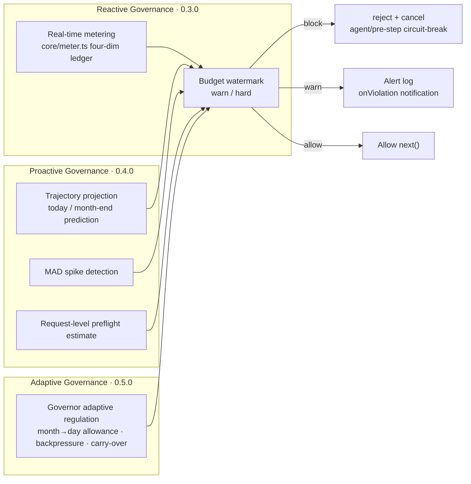

*Note: layer 0.3.0 (post-hoc metering and watermark judgment) forms the baseline; 0.4.0 wires three pre-emptive lines (projection / spike / preflight) into the same decision node; 0.5.0 turns the budget into a dynamic allowance via the adaptive Governor.*

The key to real-time metering is DSH's event loop: `session/event` (`assistant/message.usage` + `request/header.config`) provides **exact per-call token usage and routing**; `agent/pre-step` (waterfall) provides the **single clean place to stop the next model request**.

## Core Features (Diagrams & Principles)

### Real-time Metering & Peak/Off-peak Billing

Subscribes to `session/event`, converts the exact usage of each call into amount and credits at the route price, accumulates across four dimensions — total / day / month / session — plus a `provider/model` breakdown, and prices each event by the local time of occurrence (supports cross-midnight and all-day bands):

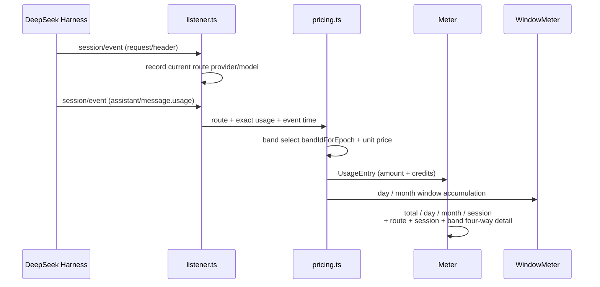

*Note: `session/event` is the single metering source; `pricing.ts` is a pure-function band selector that falls back to the base price when no band matches; amount and credits (`creditsPerMillion`) accumulate independently, and credits never participate in circuit-breaking decisions.*

### Multi-dimensional Budget Circuit-breaking

Each of session / day / month / total configures its own `limit` / `warnAt` / `hardAt`. Hitting a hard limit → return `reject` at `agent/pre-step` and `agent.cancel` to terminate the turn; hitting a warning level → log only and fire `onViolation`:

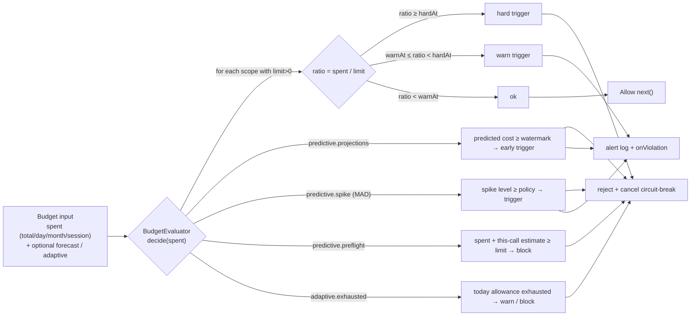

*Note: actions escalate like a "veto" — hard always blocks; warn only upgrades when the action would otherwise be allow; scopes with `limit <= 0` are skipped entirely (no cap) — this is the source of the "zero-config = metering only, no intervention" semantics.*

### Predictive Governance (0.4.0, off by default, zero regression)

Maintains a "timestamp → cumulative cost" trail for every call, extrapolates the **end-of-today / end-of-month** projected spend with a confidence interval; layered with MAD spike detection and request-level preflight, intercepts **before** overspending happens:

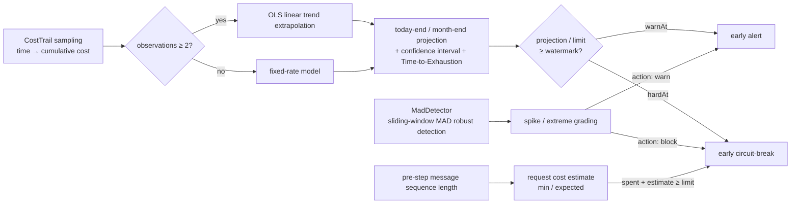

*Note: projection uses an OLS linear trend (≥2 observations) or a fixed-rate model (single observation); MAD (median absolute deviation) resists single-point contamination, so a few large requests do not skew the baseline; preflight judges "before money is spent", so even a run of medium requests cannot silently overdraft the budget.*

### Adaptive Regulation (0.5.0, off by default, zero regression)

Upgrades the budget from a "static quota" to a "self-regulating allowance" — dynamic month→day allowance derivation + consumption-rate backpressure with dynamic watermarks + cross-period carry-over:

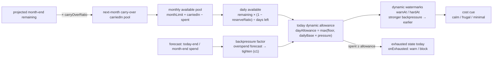

*Note: defaults are `reserveRatio=0.1` (only 90% is ever committed), `backpressure=0.5`, `floorRatio=0.3` (a 30% floor is always kept), `carryOverRatio=1` (full carry-over). "Spend fast → tighten; spend steady → relax; what you save becomes next month's pool."*

#### Cost Efficiency Insights (0.5.0)

Cost per thousand output tokens (output is the main carrier of reasoning quality), per-request cost distribution (P50 / P95 / Max / Avg, exposing the long-tail requests that drag down the budget), and route-replacement savings estimates ("switching to X is expected to save Y").

### Cache-dimension Metering (0.6.0, off by default, zero regression)

Under DeepSeek's three-channel billing, the price gap between cache hit and miss is 30–50×; previously all inputs were billed at the miss price, systematically overestimating cost. This plugin precisely parses each request's cache-hit tokens and prices them by three channels × peak/off-peak:

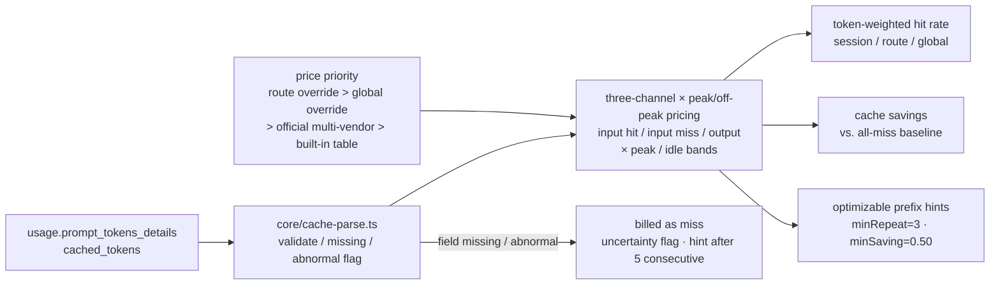

*Note: hit rate is token-weighted, not a simple average (not diluted by small requests); savings = baseline cost − actual cost; prefix hints only advise and never rewrite prompts; failure fallback keeps metrics trustworthy and auditable.*

### Official Pricing Engine (0.8.0+, off by default, zero regression)

Most accurately models DeepSeek's actual official pricing rules, and since 0.9.0 extends to **deep sync of official price catalogs across all models / global majors / domestic major models** (102 registry entries, verified 2026-10-05):

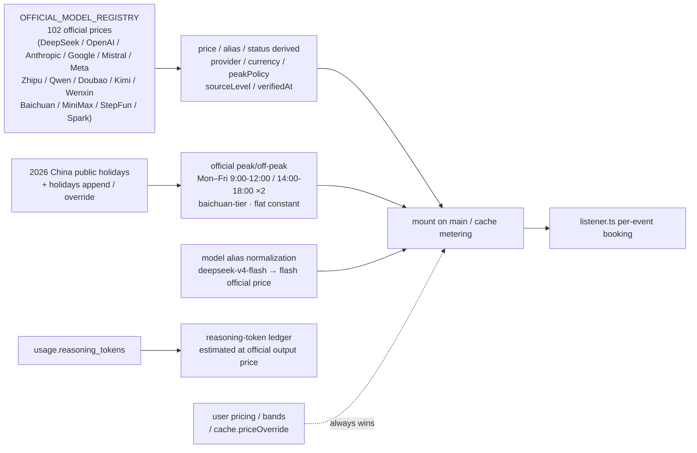

*Note: user overrides always win over official prices (overridden prices are never doubled in peaks); no fabricated Batch discounts; decommissioned models honestly record retirement dates and migration advice; currency is CNY for DeepSeek/domestic vendors and USD for overseas vendors, with no cross-currency conversion.*

### Frontier Suite (0.12.0, off by default, zero regression)

Observability + chargeback aligned with world-frontier standards — FOCUS cost ledger (FinOps v1.2, JSONL line streaming into any FinOps tool), OTel GenAI telemetry (standard span attributes + trace/session correlation, into Prometheus/Jaeger), unit economics & cost attribution (per-request / per-million-token cost, Top-N session share, Showback to business units), cost-lever insights (saved-rate / further-savable-rate for the cache-discount lever and the output lever).

### Explainable Cost RCA (0.14.0, off by default, zero regression)

From "knowing it exceeded" to "**knowing why**" — dual-view incremental contribution decomposition over sessions (which task) / routes (which model), with primary/secondary/noise grading and an explainable Chinese narrative:

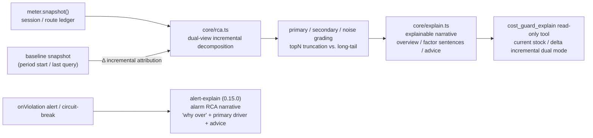

### Multi-tenant Cost Explanation View (0.16.0, off by default, zero regression)

Pushes cost attribution to the enterprise "tenant" dimension: which team / project / workspace spent the money. sessionId → tenant resolution → inter-tenant attribution + a two-level evidence chain of the primary in-tenant session:

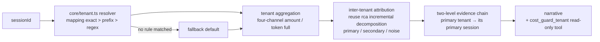

### Reasoning-Tax Governance (0.17.0, off by default, zero regression)

Upgrades the "reasoning tax" (reasoning tokens are often 5–20× the visible output, billed at the output price, and are the biggest hidden cost in the bill) from a display item into a governable object:

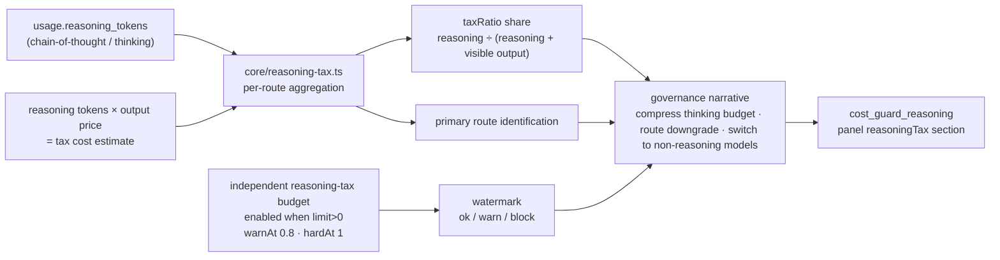

*Note: the independent reasoning-tax budget is a purely additive governance dimension and never touches existing `budgets` circuit-breaking semantics; with no budget configured (limit=0) it only shows insights, with no watermark judgment.*

### Multi-dimension Reasoning-tax Audit (0.18.0, off by default, zero regression)

Adds two more slices on top of route attribution — "which session is burning" + "when it burns": session-dimension Top N ranking + time heat-bucket dual slicing:

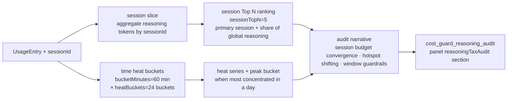

*Note: the audit ledger is orthogonal to the 0.17.0 route ledger — neither reads nor writes the other; `sessionTopN` range 1–50, `bucketMinutes` range 1–1440, `heatBuckets` range 1–168.*

### Cost Panel · Price Override · Safe Defaults

- **Cost panel**: registers the read-only tool `cost_guard_status` (callable by the model) and `CostGuardService` (via `ctx.costGuard`, injectable into other plugins), exposing a human-readable summary; it includes a `forecast` section since 0.4.0, `adaptive`/`efficiency` since 0.5.0, `frontier` since 0.12.0, `explain` since 0.14.0, `tenant` since 0.16.0, `reasoningTax` since 0.17.0, and `reasoningTaxAudit` since 0.18.0.
- **Price override**: ships with DeepSeek official prices (`deepseek-chat` / `deepseek-reasoner`), supports overrides by `provider/model` or bare `model`, with a conservative fallback price for unrecognized routes.
- **Safe defaults**: `mode=block` hard circuit-breaking + `cancelOnBlock=true` by default; set `mode=off` for pure observation; leaving predictive governance and adaptive regulation unconfigured behaves exactly like 0.3.0.

## Installation

```bash
dsh plugin add dsh-cost-guard
```

Requires Node `^22.19.0 || >=24.0.0` (same as DSH) with peer dependencies aligned to the DSH 0.1.1-rc.2 line.

## Configuration

Provide a configuration object for `cost-guard` in the DSH config (code comments remain in the original Chinese, read them alongside the description table below):

```yaml
plugins:
  cost-guard:
    enabled: true
    mode: block            # off | warn | block
    cancelOnBlock: true
    tzOffsetMin: 480       # 东八区；日/月预算按此时区切分
    # 价格覆盖（CNY / 每百万 token）：支持 'provider/model' 或裸 'model' 键
    # creditsPerMillion：该模型每百万计费 token 消耗的积分，可选，未配置按 0 计
    pricing:
      "deepseek/deepseek-chat": { inputPerMillion: 2, cacheReadPerMillion: 0.5, outputPerMillion: 8, creditsPerMillion: 100 }
    # 峰谷时段（可选）：按本地时区（tzOffsetMin）选档计价；不配置则全部按基准价
    # start === end 表示全天覆盖；start > end 表示跨午夜（如 22:00-08:00 覆盖 22:00~24:00 + 00:00~08:00）
    # 时段内未覆盖的路由/模型回退基准价表
    bands:
      - id: peak
        start: "09:00"
        end: "18:00"
        prices:
          "deepseek/deepseek-chat": { inputPerMillion: 6, cacheReadPerMillion: 1.5, outputPerMillion: 24 }
      - id: valley
        start: "22:00"
        end: "08:00"
        # 未给 valley 配 prices：带内按基准价（相当于夜间不打折的对照时段）
    # 预算：不配置的 scope 不设限
    budgets:
      session: { limit: 10,   warnAt: 0.8, hardAt: 1 }
      day:     { limit: 50,   warnAt: 0.8, hardAt: 1 }
      month:   { limit: 500,  warnAt: 0.9, hardAt: 1 }
      total:   { limit: 1000, warnAt: 0.9, hardAt: 1 }
    # 预测式治理（0.4.0，可选；不配置则行为与 0.3.0 完全一致）
    # - projections：到期投影（预测今日结束/月末花费，触及水位提前告警/熔断，支持 day/month 等）
    # - spike：成本尖峰防护（MAD 检测；level: spike(含extreme) | extreme；action: warn | block）
    # - preflight：请求级预检（每个 pre-step 按消息量估算本次成本，防单发烧穿；mode: min|expected；scope 默认 total）
    # - adaptive：自适应调节治理（0.5.0，需与下方 adaptive 节搭配；scope 默认 day，onExhausted 默认 warn）
    predictive:
      projections:
        day:   { target: 今日结束, warnAt: 0.8, hardAt: 1 }
        month: { target: 月末,     warnAt: 0.9, hardAt: 1 }
      spike: { level: extreme, action: warn }
      preflight: { mode: expected, action: block, scope: total }
      adaptive: { scope: day, onExhausted: warn }
    # 自适应调节（0.5.0，可选；不配置则行为与 0.4.0 完全一致）
    # - monthLimit：月预算上限，缺省回退 budgets.month.limit
    # - reserveRatio：日额度派生时预留的缓冲比例（只敢动用 90%）
    # - backpressure：预测超支时收紧的力度（0~1）
    # - floorRatio：日额度的下限比例（无论如何保留 30% 兜底）
    # - carryOverRatio：本月未用完中可结转到下月的比例
    adaptive:
      monthLimit: 500       # 缺省回退 budgets.month.limit
      reserveRatio: 0.1
      backpressure: 0.5
      floorRatio: 0.3
      carryOverRatio: 1
    # 缓存维度计量（0.6.0，可选；不配置或 enabled: false 则行为与 0.5.0 完全一致）
    # - 三通道价格覆盖：可按路由（'provider/model' 或裸 'model'）或全局配置
    #   idle/peak 两档的 { inputHit, inputMiss, output }（元/百万 token）；
    #   未覆盖的路由/字段回退内置官方表（flash / v4-pro，2026-09-10 生效价）
    # - hint：可优化前缀提示阈值（同一前缀重复 >= minRepeat 且潜在节省 >= minSaving 才提示）
    # - onParseFailure：解析失败固定按未命中计费并标注不确定（保留字段供策略演进）
    cache:
      enabled: false          # 默认关闭；置 true 启用缓存维度计量
      priceOverride:
        global:
          idle:  { inputHit: 0.02, inputMiss: 1.00, output: 4.00 }
          peak:  { inputHit: 0.04, inputMiss: 2.00, output: 8.00 }
      hint: { minRepeat: 3, minSaving: 0.50 }
      onParseFailure: treat-as-miss
    # 官方计价引擎（0.8.0，可选；不配置或 enabled: false 则行为与 0.7.0 完全一致）
    # - 主计量与缓存计量自动挂载 DeepSeek 官方价目（2026-09-10 生效）：
    #   flash 空闲 命中0.02/未命中1.00/输出4.00，高峰×2；v4-pro 空闲 0.15/4.50/13.50，高峰×2
    # - 官方峰谷自动判定：北京时间周一~周五（不含中国法定节假日）9:00-12:00/14:00-18:00
    # - 模型名别名归一：downlevel 旧名（deepseek-v4-flash 等）自动归一到 flash 价，不再落兜底最贵档
    # - holidays：向 2026 中国法定节假日表追加/覆盖日期（YYYY-MM-DD，追加时节假日按空闲价）
    # - 推理 token 洞察：按官方输出价累加推理（思维链）成本，独立展示
    # - 0.9.0 全模型深度同步：OFFICIAL_MODEL_REGISTRY 登记在售/下线路由/已停用全部模型，
    #   价目与别名由注册表派生，摘要与 cost_guard_status 输出官方模型状态全景（含迁移提示）
    officialPricing:
      enabled: true           # 默认关闭；置 true 启用官方计价引擎
      holidays: []            # 可选：追加法定节假日，如 ['2026-10-09']（补班日按高峰）
    # 前沿套件（0.12.0，可选；不配置或全 false 则行为与 0.11.0 完全一致）
    # - focus：FOCUS 兼容成本台账（标准 Dimension/Metric 列 + JSONL 行流出，可写文件或转发 FinOps 工具）
    # - otel：OTel GenAI 语义遥测（标准 span 属性 + trace/会话关联，可写文件或转发可观测性栈）
    # - unitEconomy：单位经济学与成本归属（每请求/每百万 token 成本、Top-N 会话占比，Showback 到业务单元）
    # - leverage：成本杠杆洞察（缓存折扣杠杆：价差倍数/已省率/可再省率；输出杠杆：价差倍数/占比/压缩可省）
    frontier:
      focus:
        enabled: false        # 默认关闭；置 true 启用 FOCUS 成本台账
        # sink: (line) => fs.appendFileSync('focus.jsonl', JSON.stringify(line) + '\n')  # 可选行流出回调
      otel:
        enabled: false        # 默认关闭；置 true 启用 OTel GenAI 遥测
        # sink: (span) => otlpExporter.send([toOtlpSpan(span)])                            # 可选 span 流出回调
      unitEconomy: false      # 默认关闭；置 true 启用单位经济学与成本归属
      leverage: false         # 默认关闭；置 true 启用成本杠杆洞察
    # 成本根因解释（0.14.0，可选；不配置则行为与 0.13.0 完全一致）
    # - 证据化根因：会话/路由双视角增量贡献分解 + 主因/次因/噪声分级
    # - 中文叙事：总览/根因因子句/可执行建议（缓存杠杆/输出压缩/路由替代）
    # - 只读工具 cost_guard_explain：Agent 自助「为什么成本涨了」（current/delta 双模式）
    explain:
      enabled: false          # 默认关闭；置 true 启用成本根因解释
      # alert（0.15.0，可选）：根因解释接入告警通知（需 explain.enabled=true）
      # - Guard 告警/熔断触发时，同一条通知输出「为什么超」的告警根因叙事
      #   （scope/水位/Δ + 会话/路由主因 + 建议），可转发 IM / 桌面通知
      # - 首次触发存量归因并沉淀基线，后续触发与告警前基线对比增量归因
      # - onExplainAlarm：可选宿主回调（收到 { scope, action, window, report, lines }，
      #   抛错自动降级不影响熔断主流程）；不配置则只输出告警根因日志行
      alert:
        enabled: false        # 默认关闭；置 true 时告警通知附带告警根因叙事
    # 多租户成本解释视图（0.16.0，可选；不配置则行为与 0.15.0 完全一致）
    # - 把成本归因推进到企业级「租户」维度：钱是哪个团队/项目/工作区花的
    # - 租户解析：sessionId -> 租户（mapping 精确映射 > prefix 前缀映射 > regex 正则提取，未命中兜底 'default'）
    # - 租户间归因 + 租户内主因会话两级证据链 + 中文叙事
    # - 只读工具 cost_guard_tenant：Agent 自助「哪个租户在烧钱」（current/delta 双模式）
    tenant:
      enabled: false          # 默认关闭；置 true 启用多租户成本解释视图
      resolve:                # 可选：sessionId -> 租户 解析规则（不提供则全部归内置 'default'）
        # mapping: { 'session-id-1': 'team-a' }   # 精确映射（最高优先级）
        # prefix: { 'team-a-': 'team-a' }         # 前缀映射（次优先级，最长前缀优先）
        # regex: { source: '^team-(?:[a-z]+)', flags: '' }  # 正则提取（最低优先级），取首个捕获组或全匹配
        # 未命中任一级规则的会话兜底归 defaultTenant（内置默认 'default'）
    # 推理成本专项治理（0.17.0，可选；不配置则行为与 0.16.0 完全一致）
    # - 独立账本按路由聚合推理 token / 可见输出，按输出价估算「思考税」
    #   （推理 token 常为可见输出 5~20 倍，是账单最大隐藏成本）
    # - 中文治理叙事：思考预算压缩 / 路由降级 / 切换非推理模型
    # - 只读工具 cost_guard_reasoning：Agent 自助「推理 token 花了多少 / 怎么省」
    reasoningTax:
      enabled: false          # 默认关闭；置 true 启用推理成本专项治理
      # budget（可选）：独立推理税预算（limit 金额 / warnAt 0~1 / hardAt 0~1）
      # - limit > 0 才启用 ok/warn/block 水位判定；未配置 budget 仅做洞察展示
      # budget: { limit: 50, warnAt: 0.8, hardAt: 1 }
    # 多维思考税审计（0.18.0，可选；不配置则行为与 0.17.0 完全一致）
    # - 在 0.17.0 路由归因之上新增「会话 Top N + 时间热力桶」双切片：
    #   哪个会话在烧思考税 / 一天中何时烧得最集中
    # - bucketMinutes：时间桶时长（分钟，默认 60）
    # - heatBuckets：热力序列保留的最近桶数（默认 24）
    # - sessionTopN：会话排行保留条数（默认 5）
    # - 只读工具 cost_guard_reasoning_audit：Agent 自助「哪个会话在烧 / 何时集中」
    reasoningTaxAudit:
      enabled: false          # 默认关闭；置 true 启用多维思考税审计
      # bucketMinutes: 60
      # heatBuckets: 24
      # sessionTopN: 5
    fallbackProvider: deepseek
    fallbackModel: deepseek-chat
    enableTool: true
    verbose: true
```

The table below is the complete field list, aligned with the `src/index.ts` schema:

| Option | Type | Default | Description |
| --- | --- | --- | --- |
| `enabled` | boolean | `true` | Master switch |
| `mode` | `off`/`warn`/`block` | `block` | `off`: metering only; `warn`: alert without blocking; `block`: hard block |
| `cancelOnBlock` | boolean | `true` | Also `agent.cancel` to terminate the turn on hard block |
| `tzOffsetMin` | number | `480` | Timezone offset (minutes) for day/month window slicing |
| `pricing` | dict | `{}` | Price overrides: `inputPerMillion`/`cacheReadPerMillion`/`outputPerMillion` (amount) + optional `creditsPerMillion` (credits per million tokens) |
| `bands` | array | `[]` | Peak/off-peak bands (optional): `{ id, start, end, prices? }`; `start===end` all-day, `start>end` cross-midnight; in-band `prices` override the base, uncovered routes fall back to base. Unconfigured: all at base price |
| `budgets` | dict | `{}` | `session`/`day`/`month`/`total` with `limit`/`warnAt`/`hardAt` |
| `fallbackProvider` | string | `deepseek` | Default provider when the route is missing |
| `fallbackModel` | string | `deepseek-chat` | Default model when the route is missing |
| `enableTool` | boolean | `true` | Whether to register the `cost_guard_status` tool |
| `verbose` | boolean | `true` | Startup summary logging |
| `predictive` | object | unconfigured | Predictive governance (0.4.0, optional): `projections` (expiry projection thresholds), `spike` (spike protection), `preflight` (request-level preflight), `adaptive` (0.5.0: `{ scope, onExhausted }`); unconfigured behaves like 0.3.0 |
| `adaptive` | object | unconfigured | Adaptive regulation (0.5.0, optional): `monthLimit` (falls back to `budgets.month.limit`), `reserveRatio` (default 0.1), `backpressure` (default 0.5), `floorRatio` (default 0.3), `carryOverRatio` (default 1); unconfigured behaves like 0.4.0 |
| `cache` | object | unconfigured | Cache-dimension metering (0.6.0, optional): `enabled` (default false), `priceOverride` (three-channel price override: `{ route? }.{ idle|peak }.{ inputHit|inputMiss|output }`, route > global > built-in official table), `hint` (`minRepeat` default 3 / `minSaving` default 0.50), `onParseFailure` (always `treat-as-miss`); unconfigured behaves like 0.5.0 |
| `officialPricing` | object | unconfigured | Official pricing engine (0.8.0+, optional): `enabled` (default false), `holidays` (optional string[], extends/overrides the 2026 Chinese public-holiday table; holidays price at off-peak); when enabled, metering and cache metering auto-mount official prices and official peak/off-peak judgment, model-name alias normalization and reasoning-token insight; since 0.9.0 the official registry covers all models (active / routed / decommissioned) and outputs an official model status overview with migration hints; 0.10.0 deep-syncs global majors' official catalogs (OpenAI/Anthropic/Google/Mistral/Meta/DeepSeek, 47 entries with currency/peak policy/cache-write prices/source grade); 0.11.0 deep-syncs domestic majors (Zhipu/Qwen/Doubao/Kimi/Wenxin/Baichuan/MiniMax/StepFun/Spark, 55 entries, CNY, per-million conversion, baichuan-tier peaks, cache-write prices, tiered prices, free models) — 102 entries total; user `pricing`/`bands`/`cache.priceOverride` always win; unconfigured behaves like 0.7.0 |
| `frontier` | object | unconfigured | Frontier suite (0.12.0, optional): `focus` (`{ enabled: false, sink? }`, FOCUS-standard cost ledger, 4096-row buffer + JSONL line-stream sink), `otel` (`{ enabled: false, sink? }`, OTel GenAI semantic spans with trace/session correlation + stream sink), `unitEconomy` (bool, unit economics: per-request / per-million-token cost + Top-N session cost attribution and share, Showback to business units), `leverage` (bool, cost-lever insight: cache-discount lever — read-vs-input price gap / saved / further-savable; output lever — price gap / cost share / 10% compression savings); unconfigured or all-false behaves like 0.11.0 |
| `explain` | object | unconfigured | Explainable cost RCA (0.14.0, optional): `enabled` (default false); when enabled registers the read-only tool `cost_guard_explain` and adds an `explain` section to `cost_guard_status` — dual-view (session/route) incremental contribution decomposition + primary/secondary/noise grading (rca.ts) + Chinese explainable narrative (overview/factor sentences/cache & output levers/route-replacement advice, explain.ts) + agent self-diagnosis (dual mode `current` stock / `delta` incremental vs. last query); since 0.15.0 supports sub-option `alert` (`{ enabled: false, onExplainAlarm? }`, requires `enabled=true`): the same notification carries an alarm-RCA narrative on Guard alert/circuit-break (scope/watermark/Δ + session/route primary drivers + advice, forwardable to IM); the first trigger attributes stock and sinks a baseline, later triggers attribute incrementally from the pre-alarm baseline; `onExplainAlarm` host callback receives a structured payload (degrades gracefully on throw); unconfigured behaves like 0.13.0 |
| `tenant` | object | unconfigured | Multi-tenant cost explanation view (0.16.0, optional): `enabled` (default false); when enabled registers the read-only tool `cost_guard_tenant` and adds a `tenant` section to `cost_guard_status` — sessionId→tenant resolution (`resolve`: `mapping` exact > `prefix` prefix > `regex` (`{ source, flags? }`) extraction, unmatched fallback `'default'`) → tenant aggregation (four-channel amount/Token) → inter-tenant attribution (reuses the rca incremental decomposition; without a baseline degrades to stock composition; primary/secondary/noise grading) + in-tenant session two-level evidence chains (which session burns inside the primary tenant) + Chinese narrative (total/overview/factors/suggestion) + agent self-diagnosis (dual mode `current`/`delta`); unconfigured or `enabled=false` behaves like 0.15.0 |
| `reasoningTax` | object | unconfigured | Reasoning-tax governance (0.17.0, optional): `enabled` (default false); when enabled registers the read-only tool `cost_guard_reasoning` and adds a `reasoningTax` section to `cost_guard_status` — per-route aggregation of reasoning tokens / visible output / reasoning cost (reasoning tokens × output price, `taxRatio` share and primary-route identification), independent reasoning-tax budget watermark (`budget`: `limit`/`warnAt`/`hardAt`; watermark ok/warn/block only when limit>0; without a budget it only shows insights) + Chinese governance narrative (thinking-budget compression / route downgrade / switch to non-reasoning models); a purely additive dimension that never touches existing `budgets` semantics; unconfigured or `enabled=false` behaves like 0.16.0 |
| `reasoningTaxAudit` | object | unconfigured | Multi-dimension reasoning-tax audit (0.18.0, optional): `enabled` (default false); when enabled registers the read-only tool `cost_guard_reasoning_audit` and adds a `reasoningTaxAudit` section to `cost_guard_status` — session-dimension Top N ranking (`sessionTopN` default 5, range 1–50, primary session + global reasoning share) + time heat buckets (`bucketMinutes` default 60 min, range 1–1440, keeps the latest `heatBuckets` default 24 buckets, range 1–168, heat series + peak bucket) + Chinese audit narrative (session thinking-budget convergence / hotspot shifting / time-window budget guardrails); orthogonal to the 0.17.0 route attribution ledger; unconfigured or `enabled=false` behaves like 0.17.0 |

### Configuration Tiers: Required vs. Auto-optimal

This plugin is designed for "maximum auto-optimality" — most options ship with safe defaults, and **the only thing the user truly must fill in is the budget amount**:

- **Required (no default substitute; without it there is no governance)**: `budgets.*.limit` (configuring `month` at minimum is recommended). A dimension with `limit <= 0` never participates in circuit-breaking or alerts (skipped at the core layer) — the plugin then only meters, never intervenes; add one cap and you enter the full governance state.
- **Conditionally required (only when enabling the corresponding feature)**:
  - `pricing` price override: needed only when using models outside the official registry (102 entries); official models automatically use official prices, and user overrides always win;
  - `tzOffsetMin`: default 480 (UTC+8), only cross-timezone deployments need to adjust (affects day/month window slicing and peak/off-peak judgment);
  - `tenant.resolve`: after enabling multi-tenant attribution, provide sessionId → tenant resolution rules so spend is correctly attributed to "which team/project/workspace"; unmatched sessions fall back to `'default'`;
  - `predictive.projections`: when enabling predictive governance, choose the projection targets (e.g. `day`/`month`); scopes without a limit are automatically skipped by preflight.
- **Auto-optimal (zero config is already the optimal default)**: safety rails default to `mode=block` + `cancelOnBlock=true`; `officialPricing.enabled: true` connects the 102-entry official catalog, peak/off-peak & holiday auto-detection and alias normalization with one click — no manual price entry needed; all module internals ship code-injected defaults — `adaptive` (`reserveRatio 0.1` / `backpressure 0.5` / `floorRatio 0.3` / `carryOverRatio 1`), `reasoningTax` (`warnAt 0.8` / `hardAt 1`), `reasoningTaxAudit` (`sessionTopN 5` / `bucketMinutes 60` / `heatBuckets 24`), `cache.hint` (`minRepeat 3` / `minSaving 0.50`); `predictive`/`adaptive`/`cache`/`frontier`/`explain`/`tenant`/`reasoningTax`/`reasoningTaxAudit` are all off by default with zero regression — upgrades never introduce unexpected intervention.

> Suggested UI shape: a visual config page only needs a "required form layer" (budget caps; optionally expand today/session/total and alert watermarks) + a "feature toggle layer" (one-line description per module, off by default, enabling gives optimal parameters immediately); advanced parameters (`priceOverride`, `tenant.resolve`, etc.) are collapsed in an "Advanced" area.

## Usage Effects

- Within budget: silent metering; the agent can self-sense usage via `cost_guard_status` (both the phone-bill amount and the credits dimension).
- At the warning watermark: `ctx.logger('cost-guard')` outputs `session 预算达到 82% (8.2/10.0)` and fires the `onViolation` callback.
- Hard limit hit: logs `total 预算已耗尽 (20.0/10.0)，已熔断`; the turn's model request is rejected and the turn cancelled; the caller may continue but no more model charges accrue.
- Status summary: `cost_guard_status` and `ctx.costGuard.summary()` output `总花费 X · 总积分 Y`; today/this-month/this-session and the main route lines also carry credits, and any invoked model is booked at its own per-credit price.
- Real-time peak/off-peak tracking: once `bands` is configured, each call is priced by the local time of the event; the summary gains `当前时段: peak (09:00-18:00)` and `今日分带: peak 6.00 元 / 积分 300 · valley 2.00 元 / 积分 100` lines; `cost_guard_status` gains `band` (current band id/range/judged-at/band table), `activePrices` (active unit prices per model in the current band), `bandTotals` (global per-band totals) and `todayBands` (today's per-band totals) — the model can sense "is it expensive right now, and by how much".
- Predictive governance (0.4.0): with `predictive` configured —
  - the summary gains a prediction line: `预测: 今日结束 ~12.50（置信 8.00..17.00）· 月末 ~380.00（置信 300.00..460.00）`;
  - the summary gains a spike line: `尖峰: 最近请求成本异常 (extreme)`;
  - the summary gains a pre-emptive trigger line: `预测式熔断: day 预测成本（今日结束）达 120% (60/50)，预测超限提前熔断`;
  - `cost_guard_status` gains the `forecast` section: `projections` (today/month-end projections & CI), `spike` (latest request level), `predictive` (pre-emptive trigger details), `samples` (trail sample count);
  - request-level preflight: every `agent/pre-step` first estimates this call's cost from message volume; crossing the line → `reject + cancel` (log line contains `预测式熔断：请求预检...`).
- Adaptive regulation (0.5.0): with `adaptive` + `predictive.adaptive` configured —
  - the summary gains an adaptive line: `自适应: 节约（今日额度 12.50 / 剩余 3.20 · 动态水位 70%/88% · 背压 82% · 月末预测剩余 120.00 · 下月结转 120.00）`; when today's allowance is exhausted it appends `自适应: 今日额度已耗尽，请降低调用频率`;
  - `cost_guard_status` gains the `adaptive` section: `scope` / `dayAllowance` (today's dynamic allowance) / `dayRemaining` / `pressure` (backpressure factor) / `warnAt` / `hardAt` (dynamic watermarks) / `projectedMonthRemaining` / `carryOver` (next-month carry-over) / `exhausted` / `cue` (calm/frugal/minimal);
  - dynamic watermarks actually drive decisions: stronger backpressure triggers day-budget alert/block earlier; when today's allowance is exhausted the period is alerted or blocked per `onExhausted`.
- Cost efficiency insights (0.5.0): the summary gains efficiency lines, e.g. `效率: 每千输出 token 成本最高 deepseek-reasoner 16.000 元（输出是质量杠杆）`, `分布: 单次请求成本 P50 1.00 · P95 8.00 · Max 30.00（5 次）`, and `将 deepseek-reasoner 的用量切换到 deepseek-chat，预计可省 5.00 元（约 50%）`; `cost_guard_status` gains the `efficiency` section: `routes` (per-route cost per 1k output tokens & per million tokens) / `distribution` (P50/P95/Max/Avg) / `replacement` (replacement savings advice).
- Cache-dimension metering (0.6.0): with `cache.enabled: true` —
  - the summary gains a cache line: `缓存: 命中率 80.0% (8000000/10000000 tokens) · 收益 7.84 元` (appends `· 不确定 N 次` when uncertain requests exist);
  - the summary gains a prefix-hint line: `提示: 前缀 deepseek/deepseek-chat#k23 近 5 次均未命中，若稳定化可节省约 1.20 元（当前命中率 0.0%）`;
  - when the cache-hit field is missing, billing falls back to miss price with an uncertainty marker; after 5 consecutive fallbacks a one-time hint `[cost-guard] 连续 5 次请求缺少缓存命中字段...` is emitted;
  - `cost_guard_status` gains the `cache` section: `summary` (global token-weighted hit rate/savings/uncertain count), `sessions` & `routes` (per-session/per-route summaries), `hints` (optimizable prefix candidates).
- Official pricing engine (0.8.0): with `officialPricing.enabled: true` —
  - the summary gains an official pricing line: `官方计价: deepseek-flash 当前 空闲（中国法定节假日） · 峰值倍率 ×2 · 命中 0.02 · 未命中 1.00 · 输出 4.00 元/M`;
  - the summary gains a reasoning-token line: `推理token: 累计 3000000 tokens · 约 12.00 元（按输出价 4.00 元/M 估算）`;
  - both metering and cache metering auto-mount official prices (effective 2026-09-10) and official peak/off-peak judgment (Beijing-time Mon–Fri non-holidays 9:00-12:00/14:00-18:00 peak ×2; weekends & holidays all-day off-peak);
  - model-name alias normalization: downlevel old names (`deepseek-v4-flash`/`deepseek-v4-flash-vision-exp`, etc.) normalize automatically to flash official prices instead of falling into the most-expensive fallback tier (previously the flash hit price was overestimated 50×);
  - independent reasoning-token metering: collects chain-of-thought tokens from `usage.reasoning_tokens` and accumulates reasoning cost at the official output price (there is no separate reasoning price);
  - user `pricing`/`bands`/`cache.priceOverride` overrides always win over official prices; the official holiday table can be extended/overridden via `holidays`.
  - Official model status overview (0.9.0): the summary gains `官方模型: 在售 2 个 · 下线路由 2 个（deepseek-v4-flash、deepseek-v4-flash-vision-exp）` and `官方停用: deepseek-chat、deepseek-reasoner、deepseek-coder 已停用（请求不再可用，迁移至 deepseek-flash / deepseek-v4-pro）` lines; `cost_guard_status` gains the `official.registry` section (per-model status/retirement date/migration target/route target).
  - Global multi-vendor overview (0.10.0): official summary lines group by vendor, e.g. `官方模型(OpenAI): 在售 8 个（USD 恒定价）`, `官方模型(Anthropic): 在售 4 个（USD 恒定价 · 缓存写价已挂载）`, `官方模型(DeepSeek): 在售 2 个（CNY 峰谷 ×2）`; `cost_guard_status` gains `official.prices` (full price route) and `official.registry` five-dimension metadata (provider/currency/peakPolicy/sourceLevel/verifiedAt/note).
  - Domestic vendor overview (0.11.0): official summary lines continue to group by vendor with currency & strategy, e.g. `官方模型(zhipu/CNY): 在售 glm-5.3、glm-5.3-flash、glm-5.3-flashx、glm-5.2、glm-5.1…`, `官方模型(qwen/CNY): 在售 qwen3.8-max、qwen3.8-flash…`, `官方模型(spark/CNY): 在售 spark-x2.5、spark-x2.5-4b…`; peak/off-peak models are marked 「官方峰谷（0-8 点低谷 / 8-24 点高峰 ×2）」, free models 「官方免费（0 元）」, tiered models with primary-tier price & tier range.
- Frontier suite (0.12.0): once any `frontier` capability is enabled —
  - the summary gains frontier lines: `前沿: FOCUS 成本台账已导出 N 行（FinOps 标准规格，JSONL 可流入任意 FinOps 工具）`, `前沿: OTel GenAI 遥测已输出 N 条 span（OpenTelemetry GenAI 语义，trace 关联会话）`;
  - the summary gains a unit-economics line: `单位经济学: 会话成本合计 X · 每请求 Y · 每百万 token Z · Top N 会话占比 P%`, followed by share-descending `｜ 成本归属 S% · 会话 … · C 元 / R 次 / T tokens` entries (Showback to business units);
  - the summary gains lever lines: `缓存杠杆: 读取价 vs 输入价差 50 倍 · 当前已省 S% · 提高命中还可再省 Y 元（缓存是最大结构性杠杆）` and `输出杠杆: 输出价差 4 倍 · 占总成本 C% · 压缩 10% 输出可省 Y 元`;
  - `cost_guard_status` gains the `frontier` section: `focus` (rows: ledger row count; exported once sink flows), `otel` (spans: count), `unitEconomy` (totalCost / costPerRequest / costPerMTokens / topSessions[share|sessionId|cost|requests|tokens]), `leverage` (cache[action|record] / output[action|record]);
  - sink callbacks stream rows in real time: FOCUS ledger rows (`FocusUsageLine`) and OTel spans (`GenAiSpan`) can be written to JSONL / forwarded via OTLP, seamlessly feeding existing FinOps and observability stacks.
- Explainable cost RCA (0.14.0): with `explain.enabled=true` —
  - registers the read-only tool `cost_guard_explain`: the agent can ask "why did this month's cost rise / what is the current cost structure" and gets a **structured RCA report + Chinese narrative + actionable advice** (dual mode: `current` stock attribution / `delta` incremental attribution vs. last query);
  - `cost_guard_status` gains the `explain` section: `window` (current/delta) + `report` (`bySession`/`byRoute` dual-view `factors` (key/cost/share/delta/deltaShare/grade) + `primary`/`secondary`/`noise` grading + `dominant` factor + `channelMix` + `totalCost`/`baselineTotalCost`/`deltaCost`/`deltaRatio`);
  - the summary gains an RCA line: `根因解释: 会话主因「taskA」占 61% · 路由主因「deepseek/deepseek-chat」占 80%` (when `explain.enabled=true`); the tool outputs `summary` + `narrative` (Chinese overview/factor sentences/advice).
- Explainable alarms (0.15.0): with `explain.enabled=true` + `explain.alert.enabled=true` —
  - when Guard alarms/circuit-breaks fire (onViolation), the same notification appends a `告警根因：` line whose first sentence answers "why the alarm" — `总预算已达 92% (9.20/10.00)，触发告警（请求放行）；较告警前基线 +7.00（+320%）` — followed by session/route primary-driver lines + advice; the first trigger attributes stock and sinks a baseline, later triggers compare incrementally against the pre-alarm baseline;
  - the startup summary appends `+ 告警根因通知`; the `onExplainAlarm` host callback can receive the structured payload (scope/action/window/report/lines), and a throwing callback degrades gracefully without affecting the circuit-breaking main flow;
  - with `alert` unconfigured (explain only), alarm behavior is exactly 0.14.0 (only the original alarm log line, no alarm-RCA appendage) — zero regression.
- Multi-tenant cost explanation view (0.16.0): with `tenant.enabled=true` —
  - registers the read-only tool `cost_guard_tenant`: the agent can ask "which tenant is burning money / why is this tenant burning" and gets a **structured tenant report + two-level evidence-chain Chinese narrative + governance advice** (dual mode: `current` stock attribution / `delta` incremental attribution vs. last query);
  - `cost_guard_status` gains the `tenant` section: `window` + `report` (`byTenant` primary/secondary/noise grading + `details` per-tenant `topSessions` evidence chains + `tenantCount`/`totalCost`/`baselineTotalCost`/`deltaCost`/`deltaRatio`) + `enabled`;
  - the summary gains a multi-tenant line: `多租户视图: 3 个租户 · 当前累计 12.34 · 主因租户 team-a 占 61% · 其主因会话 team-a/s1` (when `tenant.enabled=true`); the startup summary appends `+ 多租户成本视图`;
  - with `tenant` unconfigured, output is exactly 0.15.0 (no tenant tool / no tenant section / no multi-tenant line) — zero regression.
- Reasoning-tax governance (0.17.0): with `reasoningTax.enabled=true` —
  - registers the read-only tool `cost_guard_reasoning`: the agent can ask "how much did reasoning (thinking) tokens cost / where does it burn / how to save", and gets a **structured reasoning-tax report + Chinese narrative** (per-route reasoning tokens / visible output / tax cost, tax ratio, independent reasoning-tax budget watermark & governance advice);
  - `cost_guard_status` gains the `reasoningTax` section: `window` (current) + `report` (`totalReasoningTokens` / `totalOutputTokens` / `totalTaxCost` / `taxRatio` / `pricedRoutes` / `byRoute` (route/requests/reasoningTokens/outputTokens/taxCost) + `dominant` primary route + `budget` (limit/spent/ratio/level: ok/warn/block; present when a budget is configured with limit>0));
  - the summary gains a reasoning-tax governance line: `推理税治理: 推理 3,000,000 tokens（思考税 88% · 估算 12.00） · 主因路由 deepseek/deepseek-chat` (with a budget configured it appends ` · 推理税预算 45%（ok）`); the tool outputs `summary` + `narrative` (Chinese overview/factor/advice).
- Multi-dimension reasoning-tax audit (0.18.0): with `reasoningTaxAudit.enabled=true` —
  - registers the read-only tool `cost_guard_reasoning_audit`: the agent can ask "which session is burning the reasoning tax / when is it most concentrated / how to rein it in", and gets a **session Top-N ranking + time heat series + Chinese audit narrative**;
  - `cost_guard_status` gains the `reasoningTaxAudit` section: `window` (current) + `sessionTopN` / `heatBuckets` + `report` (`totalReasoningTokens` / `totalOutputTokens` / `totalTaxCost` / `taxRatio` / `sessionRequests` / `sessions` (key/requests/reasoningTokens/outputTokens/taxCost, Top N by tax cost descending) + `heat` (start/end/…, ascending by start time, at most `heatBuckets` buckets) + `dominantSession` primary session + `dominantBucket` peak heat bucket);
  - the summary gains an audit line: `推理税审计: 推理 3,000,000 tokens（思考税 88% · 估算 12.00） · 主因会话 session-1 · 热力峰值 09:00 起 1h` (with >1 sessions, appends descending ranking lines); the tool outputs `summary` + `narrative` + `explanation` (Chinese audit narrative + governance advice).

## Architecture

Hexagonal architecture: the domain core (`core/`, zero DSH dependencies) is decoupled from the DSH runtime (`harness/`, the thin adapter layer that is the only place touching DSH APIs); `index.ts` handles assembly and `service.ts` exposes the `CostGuardService` contract.

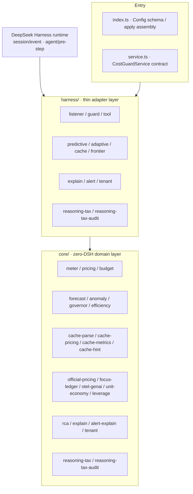

*Note: dependency direction is one-way — harness depends on core, core depends on no DSH runtime; every new capability is assembled in three steps ("core pure domain + harness thin adapter + Config switch") and is zero-regression when disabled.*

Directory structure (comments inside the tree remain in the original Chinese):

```
src/
  core/        # 零 DSH 依赖的纯领域层
    types.ts     领域类型（用量/价格/预算/快照/时段）
    clock.ts     时区日/月分桶 + 今日结束/月末时刻 + 本月剩余天数（可注入时钟，可测）
    math.ts      统计与数值工具（clamp / 排序 / 百分位插值）
    pricing.ts   定价表 + 计价（用户配置优先、内置兜底；按本地时刻选带 + 带内价覆盖）
    meter.ts     四维计量器 + 日/月窗口表 + 分带累计桶
    trail.ts     成本轨迹采样（时刻→累计，有序/幂等/有界，喂预测引擎）
    forecast.ts  预测引擎（OLS 线性趋势 + 固定速率双模型自动降级、置信区间、Time-to-Exhaustion）
    anomaly.ts   异常检测（滑动窗口 MAD 尖峰分级 + 请求级成本预检估算）
    governor.ts  自适应预算调节器（月→日额度派生 + 消费速率背压动态水位 + 跨周期结转）
    efficiency.ts 成本效率洞察（每千输出 token 成本 + 请求分布 P50/P95/Max + 路由替代节约估算）
    cache-types.ts   缓存维度领域类型（TokenSplit / CacheLedgerRow / CacheSummary / PrefixCandidate）+ 端口（CacheUsageReader / CachePricingProvider / CacheLedgerStore）
    cache-parse.ts   缓存用量解析器（cached_tokens 校验 + 缺失/异常回退标注，ParseOutcome 判别）
    cache-pricing.ts 三通道 × 峰谷定价引擎（路由覆盖 > 全局 > 官方多厂商表 > 内置官方表；官方高峰判定 = 北京时间周一~周五非法定节假日 9-12/14-18 点；0.10.0 注入官方多厂商缓存表，缺省零回归）
    official-pricing.ts 多厂商官方计价引擎（官方模型注册表 OFFICIAL_MODEL_REGISTRY：6 厂商 47 条价目 + provider/currency/peakPolicy/sourceLevel/verifiedAt 元数据 + 缓存读/写价 + 模型名别名归一 + 官方峰谷时段选带与恒定价策略 + 推理 token 账本；buildOfficialPricingTable 以用户覆盖叠加官方价，覆盖 > 官方 > 内置 > 兜底；未启用零回归）
    cache-metrics.ts 缓存账本（Token 加权命中率 / 收益金额 / 不确定请求数，全局+会话+路由三级）
    cache-hint.ts    可优化前缀提示检测器（签名归并、minRepeat/minSaving 阈值、潜在节省估算）
    focus-ledger.ts  FOCUS 兼容成本台账（v1.2 Dimension/Metric 列规格：路由于账目/行类型/计费周期/分通道用量/金额/有效成本列；4096 行有界缓冲 + sink 逐行流出 JSONL）
    otel-genai.ts    OTel GenAI 语义遥测（GenAiSpan 标准属性 gen_ai.operation.name/request.model/response.model/system/usage.* + dsh.* 扩展；fnv1a32/stableHex 派生 trace/会话关联 ID；有界账本 + sink 流出）
    unit-economy.ts  单位经济学（会话/路由归属矩阵：每请求成本、每百万 token 成本、Top-N 会话份额，FinOps for GenAI Showback）
    leverage.ts      成本杠杆洞察（缓存折扣杠杆：读取价 vs 输入价差倍数/已省率/可再省率；输出杠杆：价差倍数/成本占比/压缩可省）
    rca.ts           成本根因分析器（0.14.0：会话/路由双视角增量贡献分解，主因/次因/噪声分级，topN 截断防长尾，通道构成）
    explain.ts       可解释成本叙事（0.14.0：中文总览/根因因子句/可执行建议——缓存命中杠杆、输出压缩杠杆、路由替代提示）
    alert-explain.ts 告警根因叙事（0.15.0：告警信号 + 根因报表 → 告警专属中文叙事，首句答「为什么告警」+ 会话/路由主因 + 建议收敛，单段/逐行双格式；零 DSH）
    tenant.ts       多租户成本解释视图（0.16.0：sessionId→租户解析器（mapping>prefix>regex，未命中兜底内置 'default'）+ 租户聚合（四通道全量）+ 租户间归因（复用 rca 增量贡献分解，主因/次因/噪声分级）+ 租户内主因会话两级证据链 + 中文叙事；纯函数/JSON 安全/零 DSH）
    reasoning-tax.ts 推理成本专项治理账本（0.17.0：按路由聚合推理 token / 可见输出 / 税成本（推理 token × 输出价）+ 全局与逐路由思考税 taxRatio + 主因路由识别 + 独立推理税预算水位 ok/warn/block + 中文叙事；纯函数/无副作用/零 DSH）
    reasoning-tax-audit.ts 多维思考税审计账本（0.18.0：会话维度 Top N 排行（默认 5）+ 时间热力桶（默认 60 分钟 × 24 桶）双切片聚合推理 token / 税成本，主因会话 + 热力峰值桶 + 中文审计叙事；与路由账本正交/零 DSH）
    budget.ts    预算决策引擎（纯函数；0.4.0 预测式策略 projection/spike/preflight；0.5.0 自适应 adaptive 策略）
    store.ts     快照持久化契约
  harness/     # 薄适配层（唯一接触 DSH API 的地方）
    listener.ts   session/event → UsageEntry（实时计量，按事件时刻选带）+ 轨迹/尖峰采样
    predictive.ts 预测上下文装配（buildForecastContext / preStepEstimate / sampleEntry）
    adaptive.ts   自适应调节装配（governorConfigFromAdaptive / buildGovernorInput）
    cache.ts      缓存计量适配（DshCacheUsageReader：响应 usage → 原始快照；attachCacheMeter：事件驱动 core 账本 + 回退告警；CachePanelPresenter：面板/洞察/提示输出）
    guard.ts      agent/pre-step → reject/cancel（熔断）+ 请求级预检 + 预测式触发达告警 + 自适应输入注入
    frontier.ts   前沿套件装配（FrontierRuntime：FOCUS/OTel 账本持有、unitEconomy/leverage 开关、record 入账路由、panel 面板、formatFrontierLines 人读行）
    explain.ts    成本根因解释适配（0.14.0：ExplainRuntime——current/delta 双模式 + 基线快照、panel 面板负载、cost_guard_explain 工具注册、formatExplainLines 人读根因行）
    alert.ts      告警根因解释适配（0.15.0：attachAlertExplain——Guard 决策投影告警信号 + ExplainRuntime 基线语义、onViolation 后追加告警根因叙事、onExplainAlarm 宿主回调 + 抛错降级、formatAlarmPanelLines/formatAlarmLines 告警行）
    tenant.ts      多租户成本解释适配（0.16.0：TenantRuntime——current/delta 双模式 + 基线快照、panel 面板负载、cost_guard_tenant 只读工具注册、formatTenantLines 人读多租户行）
    reasoning-tax.ts 推理成本专项治理适配（0.17.0：ReasoningTaxRuntime——思考税账本 + 独立预算水位、panel 面板负载、cost_guard_reasoning 只读工具注册、formatReasoningTaxLines 人读思考税行）
    reasoning-tax-audit.ts 多维思考税审计适配（0.18.0：ReasoningTaxAuditRuntime——会话 Top N + 时间热力双切片账本、panel 面板负载、cost_guard_reasoning_audit 只读工具注册、formatReasoningTaxAuditLines 人读审计行）
    tool.ts       cost_guard_status 工具 + 人读摘要（当前时段/生效单价/分带分布/预测尖峰/自适应/效率/缓存/前沿/租户/推理税/思考税审计）
  index.ts      插件装配（Config / apply）
  service.ts    CostGuardService 契约（inject 给其他插件）
tests/         单元测试（vitest，419 用例：369 存量 + 多租户成本解释视图 19 + 推理成本专项治理与多维思考税审计 31（reasoning-tax 8 + harness-reasoning-tax 8 + reasoning-tax-audit 9 + harness-reasoning-tax-audit 6））
scripts/smoke.mjs  冒烟测试（真实 lib 产物 + 真实 cordis Context，17 节）
```

*Directory tree notes: 16 pure-domain modules in `core/` (incl. 0.14.0 `rca`/`explain`, 0.15.0 `alert-explain`, 0.16.0 `tenant`, 0.17.0 `reasoning-tax`, 0.18.0 `reasoning-tax-audit`); 11 adapters in `harness/`; 419 unit tests + 17 smoke sections.*

Data flow:

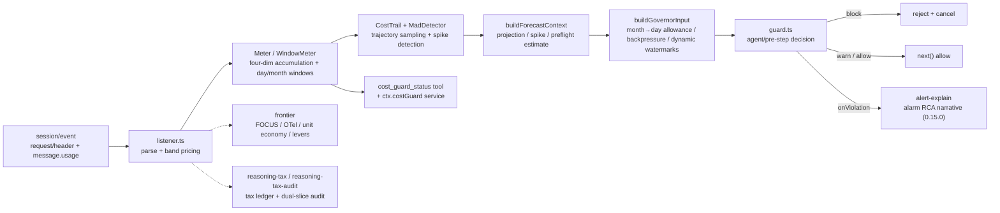

*Note: solid lines are the main metering/circuit-breaking path; dashed lines are optional modules hooked onto the sampler as a bypass — when disabled, the whole runtime is undefined and output is exactly the same as the previous version (zero regression).*

## Development

```bash
npm install        # 安装依赖（Node ≥ 22.19）
npm run typecheck  # 类型检查
npm test           # 单元测试（vitest）
npm run build      # 产出 lib/（tsc + 类型声明）
npm run smoke      # 冒烟测试：加载 lib 产物跑真实链路
npm pack           # 发布包预检
```

The commands above install dependencies (Node ≥ 22.19), type-check, run unit tests (vitest), build `lib/`, run the smoke suite against the real build, and preflight the publish package.

- New pricing scale: edit `BUILTIN_PRICES` in `core/pricing.ts`; the rule is "user config wins, built-in fallback".
- New peak/off-peak band: add `{ id, start, end, prices }` to the `bands` config; `bandIdForEpoch` in `pricing.ts` selects the band and `priceForAt` does in-band override & fallback (`inBand`/cross-midnight/all-day parsing & unit tests already live in core).
- New cache billing scale: edit `BUILTIN_CACHE_PRICES` (three-channel prices) in `core/cache-pricing.ts`; the rule is "route override > global override > built-in fallback"; the official peak judgment lives in `deepseekBandForEpoch` (injectable holiday table).
- New budget dimension: extend `BudgetScope` in `core/types.ts` and register it in `policiesFromConfig` in `budget.ts`.
- New prediction strategy: `PredictivePolicy` in `core/budget.ts` is a pure declaration (projection/spike/preflight) whose decision logic is pure functions — add unit tests directly; on the harness side only provide the corresponding fact constructor in `harness/predictive.ts` (e.g. a new projection-target time resolver).
- New event consumption: add an adapter under `harness/` (e.g. `attachCacheMeter` in `harness/cache.ts`) with the domain logic in `core/`, keeping the core free of DSH dependencies.
- Extending the frontier suite: implement a new ledger/telemetry/insight as a pure-domain module in `core/` (zero DSH), register it in `FrontierRuntime` in `harness/frontier.ts` (`record` booking routes + `panel` output section + `formatFrontierLines` human-readable lines), then add the switch to the `frontier` schema in `index.ts` — zero regression when disabled.
- Extending reasoning-tax governance/audit: implement a new attribution dimension (e.g. by task / by week) as a pure-domain ledger in `core/reasoning-tax*.ts` (zero DSH; appending to the same entry never reads or writes the other), register the runtime in `harness/reasoning-tax*.ts` (`append` booking + `panel` section + read-only tool + `format*Lines` human-readable lines), then add config to the `reasoningTax*` schemas in `index.ts` — zero regression when disabled.
- Persistence: `core/store.ts` defines the `CostSnapshot` shape (incl. per-band `bands` distribution); plugging into the `ctx.costGuard` service restores it across restarts.

## Comparison with Existing Solutions

| Solution | Form | Real-time | Blocking | In-process | Pre-emptive | Dynamic budget |
| --- | --- | --- | --- | --- | --- | --- |
| whale-report | Post-hoc report plugin | None (after the turn ends) | No | Yes | No | No |
| Token Monitor | External desktop tool | Weak (bolt-on collection) | No | No | No | No |
| OTel / usage-metered gateway | External reporting pipeline | Medium (link latency) | No / gateway-level | No | No | No |
| **dsh-cost-guard** | **Native plugin** | **Per-token per-call metering** | **Pre-request circuit-break** | **Yes** | **Trajectory projection + request preflight + spike detection** | **Month→day allowance derivation + predictive backpressure + cross-period carry-over** |

## Changelog

Below is the complete historical changelog (the original Chinese table is preserved verbatim; key milestones are also listed in English after the table).

| 版本 | 增量 |
| --- | --- |
| **0.18.0** | **多维思考税审计（Multi-Dimension Reasoning Tax Audit）：在 0.17.0 路由归因之上新增「会话维度 Top N 排行 + 时间热力桶」双切片审计——0.17.0 回答了「哪条路由在烧思考税」，0.18.0 回答「哪个会话在烧 / 一天中何时烧得最集中」。新增 core/reasoning-tax-audit.ts（零 DSH：会话维度按 sessionId 聚合推理 token/可见输出/税成本输出 Top N 排行（sessionTopN 默认 5）与主因会话 + 时间热力桶按 bucketMinutes 默认 60 分钟聚合、保留最近 heatBuckets 默认 24 个桶，输出热力序列与峰值桶 + 中文审计叙事（主因会话/热力峰值/会话思考预算收敛/热点错峰/时段预算护栏），与 0.17.0 路由账本正交互不读写），harness/reasoning-tax-audit.ts（ReasoningTaxAuditRuntime + 面板 reasoningTaxAudit 段 + 只读工具 cost_guard_reasoning_audit（市面无同类工具）+ formatReasoningTaxAuditLines 审计行）；默认关闭零回归（未启用与 0.17.0 完全一致）、core 零 DSH 保持；单测 404→419（+15：reasoning-tax-audit 9 + harness-reasoning-tax-audit 6）、tsc exit 0、build 成功、冒烟 17 节全过（新增 0.18.0 审计节，16→17）** |
| **0.17.0** | **推理成本专项治理（Reasoning Tax Governance）：把思维链「思考税」从展示项升级为可治理对象——市面 DSH 成本插件（dsh-billing / dsh-cost-meter / dsh-cost-tracker 等）只统计输入/输出/缓存三通道，无人按推理 token（思维链/thinking）专项计量与治理，而 2026 行业共识指出推理 token 按输出价计费、常为可见输出的 5~20 倍，是账单最大的隐藏成本。新增 core/reasoning-tax.ts（零 DSH：按路由聚合推理 token/可见输出/税成本（推理 token × 输出价）+ 全局与逐路由思考税 taxRatio + 主因路由识别 + 独立推理税预算水位 ok/warn/block（limit>0 才启用，纯新增维度不干预既有 budgets 熔断语义）+ 中文治理叙事（思考预算压缩/路由降级/切换非推理模型）），harness/reasoning-tax.ts（ReasoningTaxRuntime + 面板 reasoningTax 段 + 只读工具 cost_guard_reasoning + formatReasoningTaxLines 治理行）；默认关闭零回归（未启用与 0.16.0 完全一致）、core 零 DSH 保持；单测 388→404（+16：reasoning-tax 8 + harness-reasoning-tax 8）、tsc exit 0、build 成功、冒烟 16 节全过（新增 0.17.0 推理税专项节，15→16）** |
| **0.16.0** | **多租户成本解释视图（Multi-Tenant Cost Explanation View）：把成本归因从「会话/路由」推进到企业级「租户」维度——市面成本方案（LiteLLM/C1.ai/Azure/Snowflake）的归因止步于任务与模型视角，没有回答「钱是哪个团队/项目/工作区花的」，而 DSH 常被多租户共用同一实例；0.16.0 新增 core/tenant.ts（零 DSH：sessionId→租户解析器 mapping>prefix>regex + 未命中兜底内置 'default'、租户聚合四通道全量、租户间归因复用 rca 增量贡献分解主因/次因/噪声分级、租户内主因会话两级证据链、中文叙事），harness/tenant.ts（TenantRuntime current/delta 双模式 + 基线、面板 tenant 段、只读工具 cost_guard_tenant、formatTenantLines 多租户行）；默认关闭零回归（未启用与 0.15.0 完全一致）、core 零 DSH 保持；单测 369→388、tsc exit 0、ESLint 0、覆盖率门禁保持（全局 stmts 97.58%/branch 86.79%、store.ts 100%）、build 成功、冒烟 14→15 节全过** |
| **0.15.0** | **根因解释接入告警通知（Explainable Alarm）：把「知道为什么」推进到告警现场——市面成本告警只会喊「超了」，0.15.0 在 Guard 告警/熔断触发时同一条通知输出「为什么超」的中文告警根因叙事（core/alert-explain.ts 零 DSH：首句 scope/水位/Δ + 会话/路由双视角主因各 1 条 + 可执行建议，单段纯文本与逐行双格式可转发 IM/桌面通知）；harness/alert.ts 的 attachAlertExplain 挂载在 onViolation 之后，复用 ExplainRuntime 基线语义——首次触发存量归因并沉淀基线、后续与告警前基线增量归因（回答「这次为什么超」）；onExplainAlarm 宿主回调可收结构化负载（scope/action/window/report/lines），回调抛错自动降级不影响熔断主流程；explain.alert.enabled 默认关闭，未启用时告警行为与 0.14.0 完全一致（零回归）、core 零 DSH 保持；单测 349→369、tsc/ESLint 0、覆盖率门禁保持（全局 stmts 97.61%/branch 87.35%、store.ts 100%）、build 成功、冒烟 13→14 节全过** |
| 0.1.0 | 实时计量 + 四维预算 + 请求前熔断 + 成本工具 |
| 0.2.0 | 峰值时段计费（实时追踪） |
| 0.3.0 | 话费 + 积分双维度统计 |
| 0.4.0 | 预测式治理（投影 / 预检 / 尖峰），单测 56→104，冒烟 7→8 节 |
| **0.5.0** | **自适应调节（月→日额度派生 / 背压水位 / 跨周期结转）+ 成本效率洞察（每千输出成本 / 请求分布 / 替代节约建议），单测 104→128，冒烟 8→9 节** |
| **0.6.0** | **缓存维度计量（三通道×峰谷定价 / Token 加权命中率 / 缓存收益 / 可优化前缀提示 / 失败回退标注），单测 128→165，冒烟 9→11 节** |
| **0.7.0** | **深度升级：全量代码质量与健壮性治理——类型安全收敛（消除 any/断言）、边界与空值防护（NaN/Infinity/负值/缺省归一化）、错误路径 fail-safe 隔离（宿主回调异常不反噬结算与熔断链路）、schema 缺省兼容修复（0.5.0 存量配置可载入）、受控 JSON 投影（无损、拒绝 -0/循环引用）、复杂度清理（魔法数字语义化、重复计算抽取），单测 165→182** |
| **0.9.0** | **全模型官方计价深度同步：官方模型注册表（OFFICIAL_MODEL_REGISTRY）登记 DeepSeek 全部模型三状态（在售 / 下线路由 / 已停用），价目与别名由单一事实源派生、覆盖范围从 2 个在售模型扩展为官方全部模型；已停用模型（chat/reasoner/coder）如实登记停用日期与迁移建议，取价回落内置/兜底零回归；摘要与 cost_guard_status 输出官方模型状态全景（在售 N 个 · 下线路由 M 个 · 已停用迁移提示），单测 214→223** |
| **0.8.0** | **官方计价引擎：对 DeepSeek 实际计价规则体现最准确——主计量+缓存计量统一挂载官方价目（2026-09-10 生效，flash/v4-pro 空闲价 + 高峰×2）与官方峰谷自动判定（北京时间周一~周五非法定节假日 9-12/14-18 点，2026 中国法定节假日表内置）、downlevel 模型名别名归一（旧名不再落兜底最贵档）、推理 token 独立计量与成本洞察（按官方输出价）、官方节假日表可扩展、官方价可覆盖、官方无 Batch 折扣不虚构，单测 182→214，冒烟 11→12 节** |
| **0.10.0** | **多厂商官方计价深度同步：官方模型注册表扩展 provider/currency/peakPolicy/sourceLevel/verifiedAt 五维元数据，登记 OpenAI GPT(8)、Anthropic Claude(13 含缓存读+写价)、Google Gemini(10)、Mistral(6)、Meta Llama(3)、DeepSeek(7) 共 47 条官方价目（核对日 2026-10-05）；币种 DeepSeek=CNY 其余=USD 不换算；DeepSeek 官方高峰 ×2、其余厂商恒定价；缓存写价独立承载；官方全景按厂商分组、official.prices 全量路由输出，单测 →235，冒烟保持 12 节** |
| **0.11.0** | **国内主流模型官方计价深度同步：注册表总量 47→102 条，新增智谱GLM(9)、阿里通义Qwen(6)、字节豆包(4)、月之暗面Kimi(4)、百度文心(6)、百川(12)、MiniMax(3)、阶跃星辰(5)、讯飞星火(6) 共 9 家国内厂商 55 条官方价目（核对日 2026-10-05，全部 official 定价页直抓，币种 CNY）；百川/百度元/千 tokens ×1000 折算每百万；新增 baichuan-tier 峰谷策略（Baichuan2-53B 每日 0-8 点低谷 / 8-24 点高峰 ×2），officialBandForEpochOf 按模型选带；Kimi/MiniMax/Qwen 缓存写价持续承载；阶梯价主档+note；星火免费模型 0 价不触发兜底；summary 按厂商+币种分组输出，单测 235→246，冒烟保持 12 节** |
| **0.12.0** | **前沿套件（Frontier Suite）：对齐世界前沿标准把成本治理升级为可观测 + 可对账成本套件——FOCUS 成本台账（FinOps Foundation v1.2 Dimension/Metric 列规格，标准行 + 4096 行缓冲 + sink 逐行 JSONL 流出，可流入任意 FinOps 工具）、OTel GenAI 遥测（OpenTelemetry GenAI Semantic Conventions 标准 span 属性 + FNV-1a/稳定十六进制 trace·会话关联 ID + sink 流出，可进 Prometheus/Jaeger/Grafana 等可观测性栈）、单位经济学与成本归属（每请求/每百万 token 成本、Top-N 会话份额，FinOps for GenAI Showback 到业务单元）、成本杠杆洞察（缓存折扣杠杆：读取价 vs 输入价差倍数/已省率/可再省率；输出杠杆：价差倍数/占比/压缩 10% 可省）；全部默认关闭、core 零 DSH，未启用时与 0.11.0 行为完全一致（零回归），单测 246→287，冒烟保持 12 节** |
| **0.14.0** | **成本根因解释（Explainable Cost RCA）：从「知道超了」到「知道为什么」——市面成本方案止步于统计与归因（Snowflake 官方博客：knowing that an anomaly occurred is only half the battle），0.14.0 新增证据化成本根因分析（core/rca.ts：会话/路由双视角增量贡献分解，主因/次因/噪声分级，Δ 与基线对比归因，topN 截断防长尾刷屏）、可解释成本叙事（core/explain.ts：中文总览/根因因子句/可执行建议，缓存杠杆/输出压缩/路由替代建议）；注册只读工具 cost_guard_explain（Agent 自助「为什么成本涨了」+ 双模式 current/delta 增量归因）；默认关闭零回归（未启用与 0.13.0 完全一致）、core 零 DSH 保持；单测 319→349、覆盖率门禁保持（全局 stmts 97.25%/branch 86.94%、store.ts 100%）、tsc exit 0、ESLint 0、build 成功、冒烟 12→13 节全过** |
| **0.13.0** | **全量代码质量进化（Quality Evolution）：TS 5 项严格选项全开（exactOptionalPropertyTypes / noPropertyAccessFromIndexSignature / noFallthroughCasesInSwitch / noImplicitOverride / noUncheckedSideEffectImports）并清零类型错误；接入 typescript-eslint strictTypeChecked 静态检查（88 项违规归零，含 2 项有据取舍：跨边界防御式空值回退保留为准、数字模板插值放行 allowNumber）；新增 lint/coverage/quality 工程脚本与覆盖率门禁（全局 stmts≥90%/branch≥85%、store.ts 100%）；补测 45 个新用例（快照持久化/入口集成/数值统计/杠杆边界）；319 单测全绿、tsc exit 0、build 成功、冒烟 12 节全过，core 零 DSH 与零回归不变量保持** |

**English milestone summary** — Key landmarks: 0.1.0 real-time metering & four-dimensional budget with pre-request circuit-breaking → 0.2.0 peak-hour band billing → 0.3.0 dual-dimension (amount + credits) statistics → 0.4.0 predictive governance (projections / preflight / MAD spikes; tests 56→104, smoke 7→8) → 0.5.0 adaptive regulation (month→day allowance / backpressure watermarks / cross-period carry-over) + cost efficiency insights (104→128, smoke 8→9) → 0.6.0 cache-dimension metering (three channels × peak/off-peak, token-weighted hit rate, savings, prefix hints; 128→165, smoke 9→11) → 0.7.0 quality hardening (type-safety, boundary guards, fail-safe isolation, schema compat; 165→182) → 0.8.0 official pricing engine (182→214, smoke 11→12) → 0.9.0 full-model official registry sync (214→223) → 0.10.0 global multi-vendor sync (→235; USD flat, CNY DeepSeek ×2 peaks) → 0.11.0 domestic multi-vendor sync (47→102 entries, baichuan-tier peaks; 235→246) → 0.12.0 frontier suite — FOCUS ledger / OTel GenAI telemetry / unit economics / cost levers (246→287, smoke stays 12) → 0.13.0 strict TS + strictTypeChecked ESLint + coverage gates (→319) → 0.14.0 explainable cost RCA (319→349, smoke 12→13) → 0.15.0 explainable alarms (349→369, smoke 13→14) → 0.16.0 multi-tenant cost view (369→388, smoke 14→15) → 0.17.0 reasoning-tax governance (388→404, smoke 15→16) → 0.18.0 multi-dimension reasoning-tax audit (404→419, smoke 16→17).

The deep-dive milestone notes below are preserved in the original Chinese (they document each release's industry positioning, design rationale and verification numbers):

<details>
<summary>各版本深度要点（0.5–0.12，点击展开）</summary>


**0.12.0 前沿套件要点（全部保持未启用新配置时与 0.11.0 行为完全一致，零回归）：**

1. **对齐世界前沿标准的四路落点**：调研核证 FinOps 基金会 **FOCUS v1.2**（统一成本列规格 Dimension/Metric 与 Mandatory/Conditional/Optional/Recommended 功能级别，Azure 已对齐输出）、CNCF 毕业项目 **OpenTelemetry GenAI Semantic Conventions**（LLM 调用 span 标准属性 `gen_ai.operation.name`/`request.model`/`response.model`/`system`/`usage.input_tokens`/`usage.output_tokens`）、**FinOps for GenAI 单位经济学/Showback**（成本归属到业务单元）、**2026 缓存/输出杠杆共识**（缓存读取价≈输入价 0.1 倍可省 90%、输出 token 单价≈输入 4 倍压输出 ROI 最高）——四个世界级前沿全部落地为可验证能力，插件从「内部成本报表」升级为「可观测 + 可对账成本套件」。
2. **FOCUS 成本台账（`core/focus-ledger.ts`）**：`FocusUsageLine` 按 FOCUS v1.2 侧规输出标准列——路由于账目/行类型/计费周期/输入·缓存命中·输出分通道用量/金额/有效成本列，全量汇聚为有界账本（4096 行缓冲）+ `sink` 回调逐行流出（可写 JSONL 文件或转发任意 FinOps 工具）；`FocusLedger` 入账解决"成本数据能否直接与企业 FinOps 平台对账"的世界级刚需。
3. **OTel GenAI 遥测（`core/otel-genai.ts`）**：`GenAiSpan` 按 OTel GenAI Semantic Conventions 输出标准属性 + `dsh.*` 扩展（route/band/cacheReadTokens/currency/cost），用 **FNV-1a 32 位哈希 + 稳定十六进制**（`fnv1a32`/`stableHex`）从会话派生 **trace/span 关联 ID**，`OtelLedger` 有界账本 + `sink` 流出——成本轨迹可直接进 Prometheus/Jaeger/Grafana 等既有可观测性栈，不再封闭在插件内部。
4. **单位经济学与成本归属（`core/unit-economy.ts`）**：`buildUnitEconomics` 输出会话/路由归属矩阵——**每请求成本、每百万 token 成本、Top-N 会话成本占比与份额**（Showback 到业务单元），回答"钱花在哪个会话、单次任务单价多少、TOP 会话吃掉多少预算"。
5. **成本杠杆洞察（`core/leverage.ts`）**：**缓存折扣杠杆** `cacheDiscountLeverOf`——缓存读取价 vs 标准输入价差倍数（DeepSeek flash 0.02 vs 1.00 = 50 倍）、相对全未命中基线的**已省率**与**可再省率**（量化"提高命中还能再省 Y 元"）；**输出杠杆** `outputLeverOf`——输出单价 vs 输入价差倍数与输出成本占比，给出"输出压缩 10% 可省 Y 元"（输出是质量与成本的双重杠杆）。只提示、不干预请求。
6. **装配与零回归**：`src/harness/frontier.ts` 的 `FrontierRuntime` 挂在主计量 `sampler` 钩子（`index.ts` 既有 `(entry, sessionId) => {}`）上，`record` 一次入账路由到台账/遥测/单位经济/杠杆四路；`cost_guard_status` 新增 `frontier` 段、摘要新增前沿行（FOCUS 行数 / OTel span 数 / 单位经济学 / 缓存·输出杠杆）。配置 `frontier` 全部**默认关闭**，未启用时 runtime 整体 undefined、输出与 0.11.0 完全一致；四个新模块全部在 `core/` 零 DSH 依赖，六边形架构不变。单测 246 → **287** 全绿（新增 focus 7 / otel 9 / unit 4 / leverage 8 / frontier 9 / schema 4）、tsc/build/冒烟全过。

**0.11.0 国内厂商深度同步要点（全部保持未启用新配置时与 0.10.0 行为完全一致，零回归）：**

1. **9 家国内厂商 55 条官方价目单一事实源**：`OFFICIAL_MODEL_REGISTRY` 总量 47 → 102 条，新增全系国内主流模型（智谱 GLM-5.3/5.3-Flash/5.3-FlashX/5.2/5.1/5-Turbo/5/4.7/4.5-Air、通义 Qwen3.8-Max/3.8-Flash/3.5-Plus/3-Max/3.8-Omni-Flash/Qwen-Long、豆包 Seed2.1-Pro/Evolving/2.1-Turbo/Character、Kimi K3/K2.7-Code/K2.7-Code-Highspeed/K2.6、文心 ERNIE-5.0/5.0-Thinking-Preview/X1.1-Preview/4.5 系、百川 M3-Plus/M3/M2-Plus/M2/4-Turbo/4/4-Air/3-Turbo/2-Turbo/2-53B/Text-Embedding、MiniMax M3/M2.7/M2.7-Highspeed、阶跃 Step-5-Preview/3.7-Flash/3.5-Flash/1o-Turbo-Vision、星火 X2.5/X2.5-4B/X2.5-1.7B/X2/X2-Flash/Lite），价目、币种、峰谷策略、来源分级、核对日期全部由注册表派生，全部官方定价页直抓（sourceLevel=official，verifiedAt=2026-10-05）。
2. **币种与计价单位对齐**：国内 9 家厂商统一 CNY（元）；百川（官方「元/千 tokens」）与百度文心（官方「元/千 tokens」）按 ×1000 折算为「元/百万 tokens」对齐全局口径，从源头消除单位错配；DeepSeek 保持 CNY、世界厂商保持 USD，不跨币种换算、不虚构汇率。
3. **新增 baichuan-tier 峰谷策略**：百川 Baichuan2-53B 为国内唯一官方峰谷定价——每日 0:00-8:00 低谷 0.01 元/千（10/百万）、8:00-24:00 高峰 0.02 元/千（20/百万，×2）。实现 `baichuanBandForEpoch(timeMs, tzOffsetMin)`（东八区每日时段判定）与 `officialBandForEpochOf(model, timeMs, tzOffsetMin, holidays?)`（按模型策略选带：baichuan-tier 走百川时段、flat 回落 DeepSeek 峰谷判定但不影响价格——free 恒 0、flat 恒空闲价），harness listener 统一接线，flat 模型价格不随峰谷变化（零回归）。
4. **缓存写价持续承载**：ModelPrice 可选 `cacheWritePerMillion` 扩展至国内厂商——Kimi K3 缓存写 5min 档 20（1h 档 40 note）、MiniMax M2.7 系缓存写 2.625、通义 Qwen 显式缓存创建价承载（Qwen3.8-Flash 1.25、Qwen3.5-Plus 1）；未定义该字段的模型行为与 0.10.0 完全一致（零回归）。
5. **阶梯价主档+note 登记**：智谱 GLM-5.1/5-Turbo/5/4.7、通义 Qwen3.5-Plus/3-Max、百度 ERNIE-5.0 系官方按上下文长度阶梯计费——主档登记低档价、note 登记高档价与分档区间，账单侧按官方分档规则取档，展示明示阶梯区间，不虚构高档主档。
6. **免费模型不触发兜底**：讯飞星火 X2.5-4B / X2.5-1.7B / Lite 官方免费（0 元）——登记 0 价且取价标注 official（非 fallback），免费模型成本恒 0、不落入保守兜底档；传统 Spark 4.0 Ultra/Max/Pro 无现行官方价目，不登记（避免虚构）。
7. **官方事实对齐与零回归**：百川 M3-Plus 自动触发「医疗搜索」0.03 元/次、豆包缓存存储 0.017 元/小时均按官方口径登记 note（不入 token 单价）；缓存价官方未公开处保守按输入价 + note，不虚构。所有新字段仅在 `officialPricing.enabled` 且对应厂商数据存在时启用；未启用新配置时与 0.10.0 完全一致（core 零 DSH），单测 235 → 246 全绿、tsc/build/冒烟全过。

**0.10.0 多厂商深度同步要点（全部保持未启用新配置时与 0.9.0 行为完全一致，零回归）：**

1. **全球主流模型官方价目单一事实源**：`OFFICIAL_MODEL_REGISTRY`（`src/core/official-pricing.ts`）登记 6 大厂商 47 条官方价目与语义——OpenAI GPT（8 条，GPT-5.6/5.5-Pro/5.5/5.4 系）、Anthropic Claude（13 条，在售 4 + Legacy 9，含缓存读价与写价 `cacheWritePerMillion`）、Google Gemini（10 条，Gemini 3 系 + 2.5 系）、Mistral（6 条）、Meta Llama（3 条开源托管，无官方 API 价登记 `oss` 状态不定价）、DeepSeek（7 条，在售 2 / 下线路由 2 / 已停用 3）。价目、别名、元数据全部由注册表派生，数值与 0.9.0 完全一致，覆盖范围从 DeepSeek 全模型扩展为世界主流模型。
2. **五维元数据，不虚构口径**：每模型登记 `provider / currency / peakPolicy / sourceLevel / verifiedAt`——币种 DeepSeek=CNY、其余=USD（**不跨币种换算，不虚构汇率**，展示按模型标注币种）；峰谷策略 DeepSeek 官方高峰 ×2（`dsn-peak`）、其余厂商**恒定价**（`flat`，official peek=idle，band 不影响价格）；来源分级 `official`（官方价目直抓）/ `aggregated`（多源交叉）如实标注；核对日 `verifiedAt=2026-10-05`。官方未公布值（如部分缓存写价）保守取输入价 + `note` 注明，不虚构。
3. **缓存写价独立承载**：Anthropic 官方按「缓存命中读 / 缓存写入 / 未命中输入 / 输出」四通道计费；`ModelPrice` 新增可选 `cacheWritePerMillion`，`computeCost` 在定义时按 `cacheWriteTokens` 加算缓存写成本；其余厂商未定义该字段时行为与 0.9.0 完全一致（零回归）。
4. **官方全景按厂商分组展示**：摘要官方行按厂商分组（如 `官方模型(OpenAI): 在售 8 个（USD 恒定价）`）；`cost_guard_status` 返回结构新增 `official.prices` 全量价目路由（provider 按模型厂商标签）+ `official.registry` 五维元数据，用户终端即可看到全球主流模型官方价目全貌与定价策略。
5. **官方事实对齐与零回归**：OpenAI 全域名反爬时改用 Azure 官方同源页 + 官方权威媒体交叉（GPT-5.5 缓存价等未获官方确认处保守处理并不虚构）；Gemini 官方模型页直抓；Mistral 官方站不可达用双源交叉（sourceLevel=aggregated）；Meta Llama 开源权重无官方托管 API 价目 → 登记 `oss` 状态不定价。所有新字段仅在 `officialPricing.enabled` 且对应厂商数据存在时启用，未启用新配置时与 0.9.0 完全一致（core 零 DSH）。

**0.9.0 全模型深度同步要点（全部保持未启用新配置时与 0.8.0 行为完全一致，零回归）：**

1. **官方模型注册表成为单一事实源**：新增 `OFFICIAL_MODEL_REGISTRY`（`src/core/official-pricing.ts`），登记 DeepSeek 官方全部模型名与官方语义——在售 `deepseek-flash` / `deepseek-v4-pro`（官方价目）、下线路由 `deepseek-v4-flash` / `deepseek-v4-flash-vision-exp`（归一 flash 价）、已停用 `deepseek-chat` / `deepseek-reasoner` / `deepseek-coder`（无官方价，登记停用日期与迁移建议）。价目表与别名映射由注册表派生，数值与 0.8.0 完全一致，覆盖范围从 2 个在售模型扩展为官方全部模型。
2. **三状态计价语义，零回归**：active 查官方价目（高峰 = 空闲 ×2）；routed 归一目标模型后按目标价计费；decommissioned 无官方价，取价回落内置价表（chat 2/0.5/8、reasoner 4/1/16）/ 兜底（coder 4/1/16），与 0.8.0 行为完全一致，不虚构已停用模型价格。
3. **官方状态全景展示**：`cost_guard_status` 返回结构新增 `official.registry` 段，摘要输出「官方模型: 在售 N 个 · 下线路由 M 个」与「官方停用: 已停用（请求不再可用，迁移至 …）」两行，用户终端即可看到官方模型全貌与迁移目标。
4. **官方事实对齐**：以更新日志 2026-09-10 更正声明为准（9-14 之后继续提供 V4 Pro API、计费不变），排除同日新闻稿冲突表述；官方无 Batch 折扣不虚构；峰谷/节假日/推理 token 计量沿用 0.8.0 官方口径。

**0.8.0 官方计价引擎要点（全部保持未启用 new 配置时与 0.7.0 行为完全一致，零回归）：**

1. **对官方实际计价规则体现最准确**：内置 DeepSeek 官方价目表（2026-09-10 生效：`deepseek-flash` 空闲 命中 0.02 / 未命中 1.00 / 输出 4.00 元/M，`deepseek-v4-pro` 空闲 0.15 / 4.50 / 13.50 元/M，高峰 = 空闲 ×2），主计量与缓存计量统一挂载。此前主计量内置价表未收录新模型，flash 落兜底最贵档（空闲未命中 4→1 元、命中 1→0.02 元、输出 16→4 元）；启用后成本与官方账单逐通道对齐。
2. **官方峰谷自动挂载主计量**：主计量此前未配置 `bands` 时全天按基准价计费；0.8.0 按官方口径自动判定——北京时间周一至周五（**不含中国法定节假日**）9:00-12:00 与 14:00-18:00 为高峰（×2），周六周日与法定节假日全天低谷，2026 全年节假日表内置并对齐国务院公告。
3. **模型名别名归一，不再高估**：官方已下线但仍可调用的 `deepseek-v4-flash` / `deepseek-v4-flash-vision-exp` 自动归一到 flash 官方价，避免因模型名未收录而落兜底最贵档（此前命中价高估 50 倍、输出价高估 4 倍）。
4. **推理 token 独立计量**：从 `usage.reasoning_tokens` 采集思维链 token，按官方输出价（官方无单独推理价格）累加推理成本并输出累计 token 与金额，回答"思维链花了多少钱"。
5. **官方价可覆盖、节假日表可扩展、不虚构规则**：用户 `pricing` / `bands` / `cache.priceOverride` 覆盖始终优先于官方价（覆盖价不参与高峰翻倍）；`officialPricing.holidays` 可向节假日表追加/覆盖日期（补班日按工作日高峰恢复）；官方无 Batch API 批量折扣，第三方渠道行为一律不纳入产品口径。

**0.7.0 深度升级要点（全部保持未启用新配置时与 0.6.0 行为完全一致，零回归）：**

1. **类型安全收敛**：全量消除 `any` / 隐式 any / 非必要非空断言。计数、异常、预算、存储、定价、计量、治理、装配各层均以谓词守卫（`isBudgetScope`/`isCostSnapshot`/`isJsonValueSafe` 等）收紧输入类型，`strict` + `noUncheckedIndexedAccess` 下 `tsc --noEmit` 零错误。
2. **边界与极端值防护**：所有外部输入（宿主事件、配置、价格表、解析产物）统一做 null/undefined 与数值边界归一化——NaN/Infinity/负值/超限输入不再扩散为脏数据，取整与跨午夜/时区计算显式防御。
3. **错误路径 fail-safe 隔离**：计量、缓存、熔断三处事件回调及全部宿主回调（估算 / forecast / adaptive / 通知）异常时记录可识别错误并降级跳过，**绝不反噬宿主推理与结算链路**；估算不可得、评估失败时按既定语义放行并留痕。
4. **schema 缺省兼容修复**：修复 0.6.0 引入的缓存配置 schema 缺省缺陷——未配置 `cache` 的存量 0.5.0 配置加载不再误报 `missing required value`（`optionalObject` 语义：对象整体可选、一旦提供内部 required 字段必须给全），并纳入回归测试。
5. **受控 JSON 投影**：`cost_guard_status` 输出改为无损 JSON 投影（`toToolJson`），过滤未启用模块的 undefined 键，拒绝 NaN/Infinity/-0/循环引用并抛可识别错误——修复 0.6.0 的 `-0` 判断缺陷（`0 === -0` 会把合法数值 0 误判为非法值）。
6. **复杂度与可维护性**：魔法数字语义化为命名常量（高峰时段 / 预测置信权重 / 动态水位缩放 / 单位换算），抽取重复计算（带价格表预构建、动作升级统一 `escalate`），六边形依赖方向核对通过（core 零 DSH 依赖）。

0.6.0 的行业增量点（全部遵循六边形架构，core 层零 DSH 依赖，默认关闭、未配置时与 0.5.0 完全一致）：

1. **把成本算对，而不是算保守**：此前所有输入按未命中价计费，系统性高估成本（flash 价差 50 倍、v4-pro 30 倍）。0.6.0 按官方三通道口径核算，成本与账单对齐，同时首次量化出"缓存到底帮你省了多少钱"——这是成本治理类插件中首个**缓存维度计量**产品级实现。
2. **命中率按 Token 加权，而不是简单平均**：会话/路由/全局三级汇总均以命中 Token ÷ 输入 Token 计算，数据量大的请求权重更高，指标不被小请求稀释。
3. **可执行的前缀优化提示，而非"请优化"**：识别高频重复且未命中占比高的前缀，直接给出"若稳定化可节省约 Y 元"，把 50 倍价差变成可执行的省钱动作（只提示、不代改，避免破坏性自动化）。
4. **失败可归因、不脏数据**：缓存字段缺失/异常时按保守口径计费并标注不确定度，命中率统计天然隔离不可信样本，连续 5 次回退还给出升级/排查提示——保证指标可信、可审计。

0.5.0 的行业增量点（全部在 core 层零 DSH 依赖实现，默认关闭、未配置时与 0.4.0 语义完全一致）：

1. **费用自适应而不是配额僵化**：市面预算插件把 `day.limit` 当静态配额，月初猛花月底干瞪眼，或全程限死浪费冗余。0.5.0 把「今天还能花多少」变为动态派生：月剩余可用 ÷ 剩余天数，配合预测引擎的背压——花得快就紧、花得稳就松，预算自动跟随消费节奏。
2. **预测驱动的水位不是拍脑袋阈值**：静态 `warnAt/hardAt` 对所有人一刀切；0.5.0 的告警/阻断水位由当月消费速率与剩余天数实时计算，越接近月末、预测越险，水位自动下探，等于「预算越紧张，防线越靠前」。
3. **省下来的能结转，而不是归零清零**：本月末未用完 × `carryOverRatio` 结转为次月 `carriedIn` 可用池，持续"奖励"节约行为，解决"月底不敢用、月初没得用"的周期性浪费。
4. **从"花了多少"到"花得值不值"**：每千输出 token 成本把质量与成本挂钩（输出是推理质量的载体），请求成本分布暴露长尾拖累，路由替代估算直接给出行得通的省钱动作，而非一句"请控制用量"。


</details>

## License

MIT