# dsh-cost-guard

> **DeepSeek Harness 原生「实时成本治理」插件** —— 逐 token 实时计量、四维预算熔断、预测式治理、自适应调节、官方计价深度同步、缓存维度计量、成本根因解释、多租户成本视图、推理成本专项治理与多维思考税审计，全部在 Harness 进程内完成。

市面现有方案（whale-report 等）全是**事后形态**：跑完一轮才出报告，超支发生后才告诉你。`dsh-cost-guard` 是第一款**原生实时治理插件**：在 `agent/pre-step` 阶段拦下超预算的下一步请求，从源头上阻止模型继续烧钱。

| 维度 | 一句话 |
| --- | --- |
| **实时性** | 逐次调用立即计量，非事后报告 |
| **阻断能力** | 请求前熔断 `reject + cancel`，预算用尽即停 |
| **事前治理** | 预测外推 + 请求预检 + MAD 尖峰检测，超支前拦截 |
| **动态预算** | 月→日额度派生 + 消费速率背压 + 跨周期结转 |
| **可解释** | 根因叙事：为什么超 → 主因是谁 → 下一步怎么办 |

## 目录

- [为什么是它](#为什么是它)
- [核心特性（图文原理）](#核心特性图文原理)
- [安装](#安装)
- [配置](#配置)
- [使用效果](#使用效果)
- [架构](#架构)
- [二次开发](#二次开发)
- [与现有方案对比](#与现有方案对比)
- [版本演进](#版本演进)
- [License](#license)

## 为什么是它

DeepSeek Harness（DSH）是官方开源的 Agent Harness（"一切皆插件"，Cordis 驱动，npm 分发）。社区插件生态目前缺失一块刚需能力：

| 场景 | 现状 | dsh-cost-guard |
| --- | --- | --- |
| 成本可见性 | 事后报告 / 外部工具 | **进程内实时计量**，会话/日/月/总四维 + 按路由拆分 |
| 超支防护 | 无 / 只能手动停 | **模型请求前熔断**，硬限 reject + cancel，预算用尽即停 |
| 成本感知 | 模型无感知 | 注册 `cost_guard_status` 工具，Agent 可自查询预算水位 |
| 价格适配 | 固定写死 | 内置 DeepSeek 官方价 + 任意 provider/model 价格覆盖 |
| 峰谷计价 | 无 | **按本地时段选档计价**，跨午夜/全天时段 + 按带价格覆盖 |
| **超支预警** | 事后账单才知道 | **预测式治理**：轨迹外推 → 预测今日/月末花费，超支前提前熔断 |
| **单发防护** | 无 | **请求级预检**：发请求前按消息量估算成本，防止单发烧穿预算 |
| **异常感知** | 月结才发现 | **MAD 成本尖峰检测**：稳健离群识别，尖峰请求即刻分级告警/熔断 |
| **预算僵化** | 月初猛花月底干瞪眼 / 限死冗余 | **自适应调节**：月→日额度动态派生 + 消费速率背压 + 跨周期结转 |
| **效率盲区** | 只知花了多少，不知花得值不值 | **效率洞察**：每千输出 token 成本、请求成本分布、路由替代节约建议 |
| **缓存盲区** | 全部输入按未命中价计费，高估成本 | **缓存维度计量**：三通道×峰谷定价、Token 加权命中率、缓存收益、可优化前缀提示 |
| **计价失真** | 新模型未收录落兜底最贵档、主计量无官方峰谷 | **官方计价引擎**：官方价目 + 官方峰谷自动挂载、旧名别名归一、推理 token 按官方价计量；0.9.0 全模型注册表同步 + 官方状态全景 |
| **成本不可对账** | 成本数据封闭在插件内部、无法进企业 FinOps/可观测性栈 | **前沿套件**：FOCUS 标准成本台账（JSONL 可流入 FinOps 工具）+ OTel GenAI 语义遥测（可进 Prometheus/Jaeger）+ 单位经济学 Showback + 缓存/输出成本杠杆 |

### 三层治理总览

插件把「事后 + 事前 + 动态」三层治理接成一条防护链，全部落在 DSH 的原生事件闭环里：

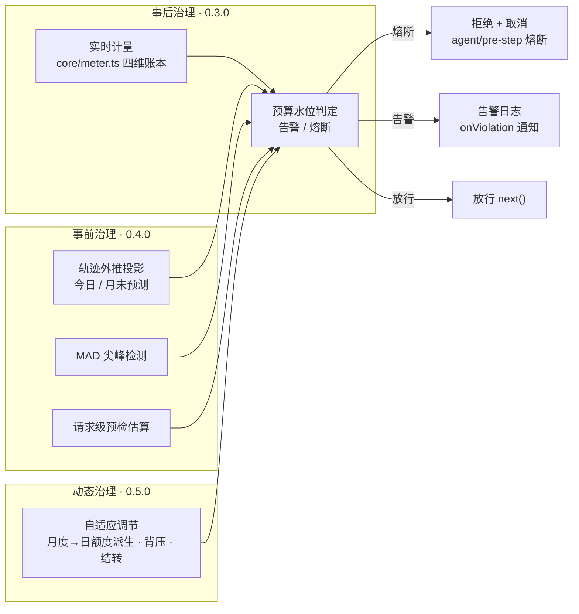

实时计量的关键是 DSH 的事件闭环：`session/event`（`assistant/message.usage` + `request/header.config`）提供**逐次调用的精确 token 用量与路由**；`agent/pre-step`（waterfall）提供**阻止下一步模型请求**的唯一干净位置。

## 核心特性（图文原理）

### 实时计量与峰谷计费

订阅 `session/event`，把每次调用的精确 usage 按路由价格折算金额与积分，累计到 total / day / month / session 四个维度 + 按 `provider/model` 明细，并按事件发生的本地时刻选档计价（支持跨午夜与全天时段）：

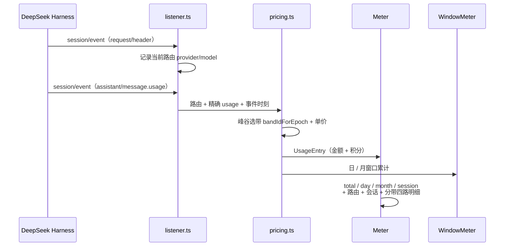

*图注：`session/event` 是计量唯一数据源；`pricing.ts` 纯函数选带计价，未命中时段回退基准价；金额与积分（`creditsPerMillion`）双维度独立累计，积分不参与熔断判定。*

### 多维预算熔断

session / day / month / total 各自独立配置 `limit` / `warnAt` / `hardAt`。命中硬限 → 在 `agent/pre-step` 返回 `reject` 并 `agent.cancel` 终止轮次；命中告警 → 只记日志并触发 `onViolation`：

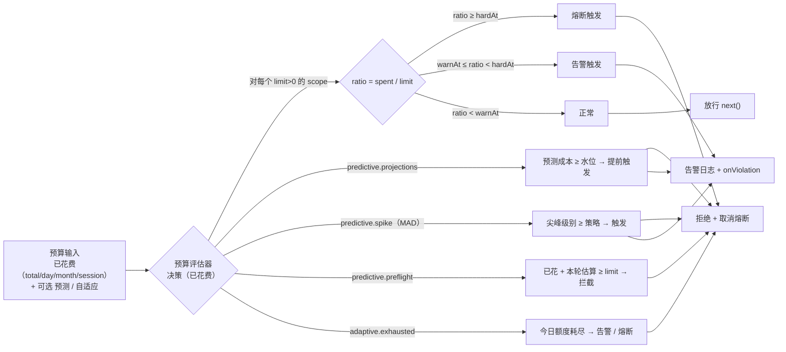

*图注：动作为「一票否决」式升级——hard 一律 block；warn 仅在仍为 allow 时提升；`limit <= 0` 的 scope 直接跳过（不设限），这是「零配置 = 只计量不干预」的语义来源。*

### 预测式治理（0.4.0，默认关闭，零回归）

为每次调用维护「时刻 → 累计成本」轨迹，外推**今日结束 / 本月底**预计花费并给出置信区间；叠加 MAD 尖峰检测与请求级预检，在超支**发生之前**拦截：

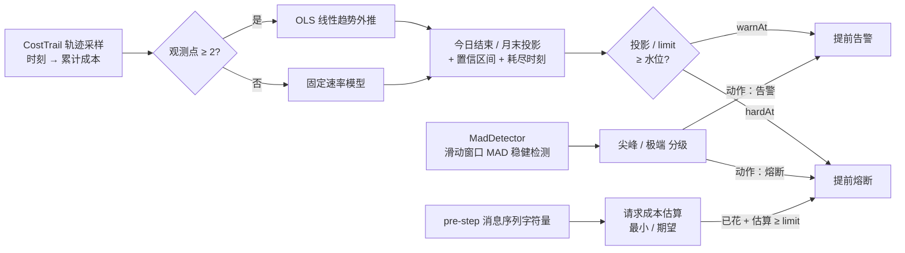

*图注：投影用最小二乘线性趋势（≥2 观测点）或固定速率模型（单观测点）；MAD（中位数绝对偏差）抗单点污染，少量大请求不污染基准；预检在「花出去之前」判断，连串中等请求也无法悄悄透支。*

### 自适应调节（0.5.0，默认关闭，零回归）

把预算从「静态配额」升级为「会自我调节的额度」——月度→日额度动态派生 + 消费速率背压动态水位 + 跨周期结转：

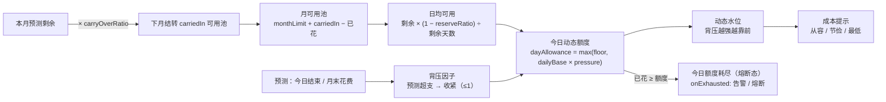

*图注：默认 `reserveRatio=0.1`（只敢动用 90%）、`backpressure=0.5`、`floorRatio=0.3`（无论如何保留 30% 兜底）、`carryOverRatio=1`（全量结转）。「花得快就紧，花得稳就松；省下来的变成下个月的池子」。*

#### 成本效率洞察（0.5.0）

每千输出 token 成本（输出是推理质量的主要载体）、单请求成本分布（P50 / P95 / Max / Avg，揪出拖垮预算的长尾请求）、路由替代节约估算（"换用 X 预计可省 Y 元"）。

### 缓存维度计量（0.6.0，默认关闭，零回归）

DeepSeek 三通道计费下缓存命中与未命中价差高达 30–50 倍，此前所有输入都按未命中价计费、系统性高估成本。本插件精确解析每次请求的缓存命中 Token，按三通道 × 峰谷定价：

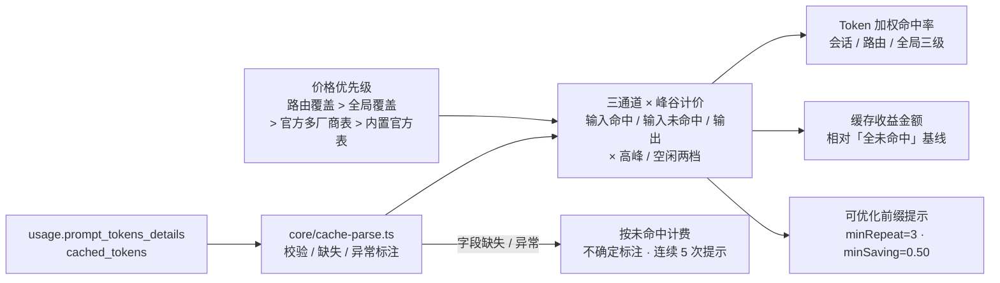

*图注：命中率按 Token 加权而非简单平均（不被小请求稀释）；收益 = 基线成本 − 实际成本；前缀提示只提示不自动改写 Prompt；失败回退保证指标可信、可审计。*

### 官方计价引擎（0.8.0+，默认关闭，零回归）

对 DeepSeek 官方实际计价规则做最准确表达，并从 0.9.0 起扩展为**全模型/全球/国内主流模型官方价目深度同步**（注册表 102 条，核对日 2026-10-05）：

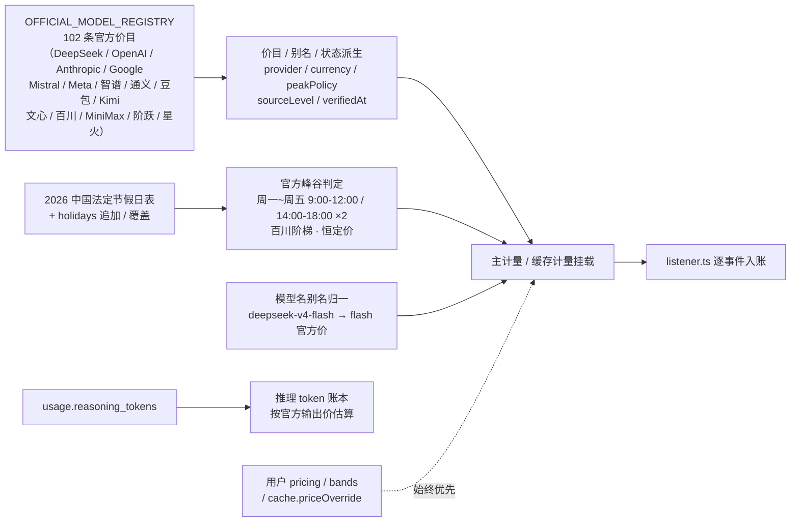

*图注：用户覆盖始终优先于官方价（覆盖价不参与高峰翻倍）；官方无 Batch 折扣不虚构；已停用模型如实登记停用日期与迁移建议；币种 DeepSeek/国内厂商 CNY、海外厂商 USD，不跨币种换算。*

### 前沿套件（0.12.0，默认关闭，零回归）

对齐世界前沿标准的可观测 + 可对账能力——FOCUS 成本台账（FinOps v1.2，JSONL 行流出可流入任意 FinOps 工具）、OTel GenAI 遥测（标准 span 属性 + trace/会话关联，可进 Prometheus/Jaeger）、单位经济学与成本归属（每请求/每百万 token 成本、Top-N 会话份额，Showback 到业务单元）、成本杠杆洞察（缓存折扣杠杆与输出杠杆的已省率 / 可再省率）。

### 成本根因解释（0.14.0，默认关闭，零回归）

从「知道超了」到「**知道为什么**」——会话（哪个任务）/ 路由（哪个模型）双视角增量贡献分解，输出主因/次因/噪声分级与中文可解释叙事：

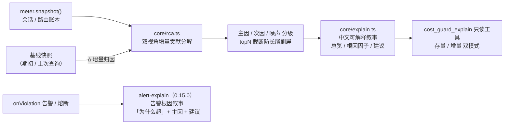

### 多租户成本解释视图（0.16.0，默认关闭，零回归）

把成本归因推进到企业级「租户」维度：钱是哪个团队 / 项目 / 工作区花的。sessionId → 租户解析 → 租户间归因 + 租户内主因会话两级证据链：

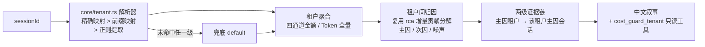

### 推理成本专项治理（0.17.0，默认关闭，零回归）

把「思考税」（推理 token 常为可见输出 5~20 倍，按输出价计费，是账单最大的隐藏成本）从展示项升级为可治理对象：

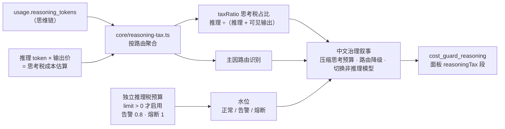

*图注：独立推理税预算为纯新增治理维度，不干预既有 budgets 熔断语义；未配置预算（limit=0）时仅做洞察展示，无水位判定。*

### 多维思考税审计（0.18.0，默认关闭，零回归）

在路由归因之上再切两刀——「哪个会话在烧」+「什么时候在烧」：会话维度 Top N 排行 + 时间热力桶双切片：

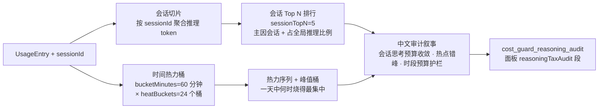

*图注：审计账本与 0.17.0 路由账本正交互不读写；`sessionTopN` 范围 1~50、`bucketMinutes` 范围 1~1440、`heatBuckets` 范围 1~168。*

### 成本面板 · 价格覆盖 · 安全默认

- **成本面板**：注册只读工具 `cost_guard_status`（模型可调用）与 `CostGuardService`（`ctx.costGuard`，其他插件可注入），暴露人读摘要；0.4.0 起含 `forecast` 段、0.5.0 起含 `adaptive` / `efficiency` 段、0.12.0 起含 `frontier` 段、0.14.0 起含 `explain` 段、0.16.0 起含 `tenant` 段、0.17.0 起含 `reasoningTax` 段、0.18.0 起含 `reasoningTaxAudit` 段。
- **价格覆盖**：内置 DeepSeek 官方价（`deepseek-chat` / `deepseek-reasoner`），支持按 `provider/model` 或裸 `model` 覆盖，未识别路由走保守兜底价。
- **安全默认**：默认 `mode=block` 硬熔断 + `cancelOnBlock=true`；想纯观察可 `mode=off`；预测式治理与自适应调节默认不配置 = 与 0.3.0 行为完全一致。

## 安装

```bash
dsh plugin add dsh-cost-guard
```

要求 Node `^22.19.0 || >=24.0.0`（与 DSH 一致），peer 依赖与 DSH 0.1.1-rc.2 系列对齐。

## 配置

在 DSH 配置中为 `cost-guard` 提供配置对象：

```yaml
plugins:
  cost-guard:
    enabled: true
    mode: block            # off | warn | block
    cancelOnBlock: true
    tzOffsetMin: 480       # 东八区；日/月预算按此时区切分
    # 价格覆盖（CNY / 每百万 token）：支持 'provider/model' 或裸 'model' 键
    # creditsPerMillion：该模型每百万计费 token 消耗的积分，可选，未配置按 0 计
    pricing:
      "deepseek/deepseek-chat": { inputPerMillion: 2, cacheReadPerMillion: 0.5, outputPerMillion: 8, creditsPerMillion: 100 }
    # 峰谷时段（可选）：按本地时区（tzOffsetMin）选档计价；不配置则全部按基准价
    # start === end 表示全天覆盖；start > end 表示跨午夜（如 22:00-08:00 覆盖 22:00~24:00 + 00:00~08:00）
    # 时段内未覆盖的路由/模型回退基准价表
    bands:
      - id: peak
        start: "09:00"
        end: "18:00"
        prices:
          "deepseek/deepseek-chat": { inputPerMillion: 6, cacheReadPerMillion: 1.5, outputPerMillion: 24 }
      - id: valley
        start: "22:00"
        end: "08:00"
        # 未给 valley 配 prices：带内按基准价（相当于夜间不打折的对照时段）
    # 预算：不配置的 scope 不设限
    budgets:
      session: { limit: 10,   warnAt: 0.8, hardAt: 1 }
      day:     { limit: 50,   warnAt: 0.8, hardAt: 1 }
      month:   { limit: 500,  warnAt: 0.9, hardAt: 1 }
      total:   { limit: 1000, warnAt: 0.9, hardAt: 1 }
    # 预测式治理（0.4.0，可选；不配置则行为与 0.3.0 完全一致）
    # - projections：到期投影（预测今日结束/月末花费，触及水位提前告警/熔断，支持 day/month 等）
    # - spike：成本尖峰防护（MAD 检测；level: spike(含extreme) | extreme；action: warn | block）
    # - preflight：请求级预检（每个 pre-step 按消息量估算本次成本，防单发烧穿；mode: min|expected；scope 默认 total）
    # - adaptive：自适应调节治理（0.5.0，需与下方 adaptive 节搭配；scope 默认 day，onExhausted 默认 warn）
    predictive:
      projections:
        day:   { target: 今日结束, warnAt: 0.8, hardAt: 1 }
        month: { target: 月末,     warnAt: 0.9, hardAt: 1 }
      spike: { level: extreme, action: warn }
      preflight: { mode: expected, action: block, scope: total }
      adaptive: { scope: day, onExhausted: warn }
    # 自适应调节（0.5.0，可选；不配置则行为与 0.4.0 完全一致）
    # - monthLimit：月预算上限，缺省回退 budgets.month.limit
    # - reserveRatio：日额度派生时预留的缓冲比例（只敢动用 90%）
    # - backpressure：预测超支时收紧的力度（0~1）
    # - floorRatio：日额度的下限比例（无论如何保留 30% 兜底）
    # - carryOverRatio：本月未用完中可结转到下月的比例
    adaptive:
      monthLimit: 500       # 缺省回退 budgets.month.limit
      reserveRatio: 0.1
      backpressure: 0.5
      floorRatio: 0.3
      carryOverRatio: 1
    # 缓存维度计量（0.6.0，可选；不配置或 enabled: false 则行为与 0.5.0 完全一致）
    # - 三通道价格覆盖：可按路由（'provider/model' 或裸 'model'）或全局配置
    #   idle/peak 两档的 { inputHit, inputMiss, output }（元/百万 token）；
    #   未覆盖的路由/字段回退内置官方表（flash / v4-pro，2026-09-10 生效价）
    # - hint：可优化前缀提示阈值（同一前缀重复 >= minRepeat 且潜在节省 >= minSaving 才提示）
    # - onParseFailure：解析失败固定按未命中计费并标注不确定（保留字段供策略演进）
    cache:
      enabled: false          # 默认关闭；置 true 启用缓存维度计量
      priceOverride:
        global:
          idle:  { inputHit: 0.02, inputMiss: 1.00, output: 4.00 }
          peak:  { inputHit: 0.04, inputMiss: 2.00, output: 8.00 }
      hint: { minRepeat: 3, minSaving: 0.50 }
      onParseFailure: treat-as-miss
    # 官方计价引擎（0.8.0，可选；不配置或 enabled: false 则行为与 0.7.0 完全一致）
    # - 主计量与缓存计量自动挂载 DeepSeek 官方价目（2026-09-10 生效）：
    #   flash 空闲 命中0.02/未命中1.00/输出4.00，高峰×2；v4-pro 空闲 0.15/4.50/13.50，高峰×2
    # - 官方峰谷自动判定：北京时间周一~周五（不含中国法定节假日）9:00-12:00/14:00-18:00
    # - 模型名别名归一：downlevel 旧名（deepseek-v4-flash 等）自动归一到 flash 价，不再落兜底最贵档
    # - holidays：向 2026 中国法定节假日表追加/覆盖日期（YYYY-MM-DD，追加时节假日按空闲价）
    # - 推理 token 洞察：按官方输出价累加推理（思维链）成本，独立展示
    # - 0.9.0 全模型深度同步：OFFICIAL_MODEL_REGISTRY 登记在售/下线路由/已停用全部模型，
    #   价目与别名由注册表派生，摘要与 cost_guard_status 输出官方模型状态全景（含迁移提示）
    officialPricing:
      enabled: true           # 默认关闭；置 true 启用官方计价引擎
      holidays: []            # 可选：追加法定节假日，如 ['2026-10-09']（补班日按高峰）
    # 前沿套件（0.12.0，可选；不配置或全 false 则行为与 0.11.0 完全一致）
    # - focus：FOCUS 兼容成本台账（标准 Dimension/Metric 列 + JSONL 行流出，可写文件或转发 FinOps 工具）
    # - otel：OTel GenAI 语义遥测（标准 span 属性 + trace/会话关联，可写文件或转发可观测性栈）
    # - unitEconomy：单位经济学与成本归属（每请求/每百万 token 成本、Top-N 会话占比，Showback 到业务单元）
    # - leverage：成本杠杆洞察（缓存折扣杠杆：价差倍数/已省率/可再省率；输出杠杆：价差倍数/占比/压缩可省）
    frontier:
      focus:
        enabled: false        # 默认关闭；置 true 启用 FOCUS 成本台账
        # sink: (line) => fs.appendFileSync('focus.jsonl', JSON.stringify(line) + '\n')  # 可选行流出回调
      otel:
        enabled: false        # 默认关闭；置 true 启用 OTel GenAI 遥测
        # sink: (span) => otlpExporter.send([toOtlpSpan(span)])                            # 可选 span 流出回调
      unitEconomy: false      # 默认关闭；置 true 启用单位经济学与成本归属
      leverage: false         # 默认关闭；置 true 启用成本杠杆洞察
    # 成本根因解释（0.14.0，可选；不配置则行为与 0.13.0 完全一致）
    # - 证据化根因：会话/路由双视角增量贡献分解 + 主因/次因/噪声分级
    # - 中文叙事：总览/根因因子句/可执行建议（缓存杠杆/输出压缩/路由替代）
    # - 只读工具 cost_guard_explain：Agent 自助「为什么成本涨了」（current/delta 双模式）
    explain:
      enabled: false          # 默认关闭；置 true 启用成本根因解释
      # alert（0.15.0，可选）：根因解释接入告警通知（需 explain.enabled=true）
      # - Guard 告警/熔断触发时，同一条通知输出「为什么超」的告警根因叙事
      #   （scope/水位/Δ + 会话/路由主因 + 建议），可转发 IM / 桌面通知
      # - 首次触发存量归因并沉淀基线，后续触发与告警前基线对比增量归因
      # - onExplainAlarm：可选宿主回调（收到 { scope, action, window, report, lines }，
      #   抛错自动降级不影响熔断主流程）；不配置则只输出告警根因日志行
      alert:
        enabled: false        # 默认关闭；置 true 时告警通知附带告警根因叙事
    # 多租户成本解释视图（0.16.0，可选；不配置则行为与 0.15.0 完全一致）
    # - 把成本归因推进到企业级「租户」维度：钱是哪个团队/项目/工作区花的
    # - 租户解析：sessionId -> 租户（mapping 精确映射 > prefix 前缀映射 > regex 正则提取，未命中兜底 'default'）
    # - 租户间归因 + 租户内主因会话两级证据链 + 中文叙事
    # - 只读工具 cost_guard_tenant：Agent 自助「哪个租户在烧钱」（current/delta 双模式）
    tenant:
      enabled: false          # 默认关闭；置 true 启用多租户成本解释视图
      resolve:                # 可选：sessionId -> 租户 解析规则（不提供则全部归内置 'default'）
        # mapping: { 'session-id-1': 'team-a' }   # 精确映射（最高优先级）
        # prefix: { 'team-a-': 'team-a' }         # 前缀映射（次优先级，最长前缀优先）
        # regex: { source: '^team-(?:[a-z]+)', flags: '' }  # 正则提取（最低优先级），取首个捕获组或全匹配
        # 未命中任一级规则的会话兜底归 defaultTenant（内置默认 'default'）
    # 推理成本专项治理（0.17.0，可选；不配置则行为与 0.16.0 完全一致）
    # - 独立账本按路由聚合推理 token / 可见输出，按输出价估算「思考税」
    #   （推理 token 常为可见输出 5~20 倍，是账单最大隐藏成本）
    # - 中文治理叙事：思考预算压缩 / 路由降级 / 切换非推理模型
    # - 只读工具 cost_guard_reasoning：Agent 自助「推理 token 花了多少 / 怎么省」
    reasoningTax:
      enabled: false          # 默认关闭；置 true 启用推理成本专项治理
      # budget（可选）：独立推理税预算（limit 金额 / warnAt 0~1 / hardAt 0~1）
      # - limit > 0 才启用 ok/warn/block 水位判定；未配置 budget 仅做洞察展示
      # budget: { limit: 50, warnAt: 0.8, hardAt: 1 }
    # 多维思考税审计（0.18.0，可选；不配置则行为与 0.17.0 完全一致）
    # - 在 0.17.0 路由归因之上新增「会话 Top N + 时间热力桶」双切片：
    #   哪个会话在烧思考税 / 一天中何时烧得最集中
    # - bucketMinutes：时间桶时长（分钟，默认 60）
    # - heatBuckets：热力序列保留的最近桶数（默认 24）
    # - sessionTopN：会话排行保留条数（默认 5）
    # - 只读工具 cost_guard_reasoning_audit：Agent 自助「哪个会话在烧 / 何时集中」
    reasoningTaxAudit:
      enabled: false          # 默认关闭；置 true 启用多维思考税审计
      # bucketMinutes: 60
      # heatBuckets: 24
      # sessionTopN: 5
    fallbackProvider: deepseek
    fallbackModel: deepseek-chat
    enableTool: true
    verbose: true
```

| 配置项 | 类型 | 默认 | 说明 |
| --- | --- | --- | --- |
| `enabled` | boolean | `true` | 总开关 |
| `mode` | `off`/`warn`/`block` | `block` | `off` 只计量；`warn` 超限告警不阻断；`block` 硬阻断 |
| `cancelOnBlock` | boolean | `true` | 硬阻断时同时 `agent.cancel` 终止轮次 |
| `tzOffsetMin` | number | `480` | 日/月窗口切分的时区偏移（分钟） |
| `pricing` | dict | `{}` | 价格覆盖：`inputPerMillion`/`cacheReadPerMillion`/`outputPerMillion`（金额）+ 可选 `creditsPerMillion`（每百万 token 积分单价） |
| `bands` | array | `[]` | 峰谷时段（可选）：`{ id, start, end, prices? }`；`start===end` 全天、`start>end` 跨午夜；带内 `prices` 覆盖基准价，未覆盖回退基准价。不配置则全部按基准价 |
| `budgets` | dict | `{}` | `session`/`day`/`month`/`total` 的 `limit`/`warnAt`/`hardAt` |
| `fallbackProvider` | string | `deepseek` | 路由缺失时的默认 provider |
| `fallbackModel` | string | `deepseek-chat` | 路由缺失时的默认模型 |
| `enableTool` | boolean | `true` | 是否注册 `cost_guard_status` 工具 |
| `verbose` | boolean | `true` | 启动摘要日志 |
| `predictive` | object | 未配置 | 预测式治理（0.4.0，可选）：`projections`（到期投影阈值）、`spike`（尖峰防护）、`preflight`（请求级预检）、`adaptive`（0.5.0：`{ scope, onExhausted }`）；不配置则与 0.3.0 行为一致 |
| `adaptive` | object | 未配置 | 自适应调节（0.5.0，可选）：`monthLimit`（缺省回退 `budgets.month.limit`）、`reserveRatio`（默认 0.1）、`backpressure`（默认 0.5）、`floorRatio`（默认 0.3）、`carryOverRatio`（默认 1）；不配置则与 0.4.0 行为一致 |
| `cache` | object | 未配置 | 缓存维度计量（0.6.0，可选）：`enabled`（默认 false）、`priceOverride`（三通道价格覆盖：`{ route? }.{ idle|peak }.{ inputHit|inputMiss|output }`，覆盖 > 全局 > 内置官方表）、`hint`（`minRepeat` 默认 3 / `minSaving` 默认 0.50）、`onParseFailure`（固定 `treat-as-miss`）；不配置则与 0.5.0 行为一致 |
| `officialPricing` | object | 未配置 | 官方计价引擎（0.8.0，可选）：`enabled`（默认 false）、`holidays`（可选 string[]，向 2026 中国法定节假日表追加/覆盖日期，节假日全天按空闲价）；启用后主计量与缓存计量自动挂载官方价目与官方峰谷判定、模型名别名归一、推理 token 洞察；0.9.0 起官方模型注册表覆盖全部模型（在售/下线路由/已停用），输出官方模型状态全景与迁移提示；0.10.0 起深度同步全球主流模型官方价目（OpenAI/Anthropic/Google/Mistral/Meta/DeepSeek 共 47 条，含币种/峰谷策略/缓存写价/来源分级），官方全景按厂商分组展示；0.11.0 起深度同步国内主流模型官方价目（智谱/通义/豆包/Kimi/文心/百川/MiniMax/阶跃/星火共 55 条，CNY、元/千→元/百万折算、baichuan-tier 峰谷、缓存写价、阶梯价、免费模型），注册表总量 102 条；用户 `pricing`/`bands`/`cache.priceOverride` 覆盖始终优先；不配置则与 0.7.0 行为一致 |
| `frontier` | object | 未配置 | 前沿套件（0.12.0，可选）：`focus`（`{ enabled: false, sink? }`，FOCUS 标准成本台账，4096 行缓冲 + JSONL 行流出回调）、`otel`（`{ enabled: false, sink? }`，OTel GenAI 语义 span 遥测，trace/会话关联 + 行流出回调）、`unitEconomy`（bool，单位经济学：每请求/每百万 token 成本 + Top-N 会话成本归属与份额，Showback 到业务单元）、`leverage`（bool，成本杠杆洞察：缓存折扣杠杆——读取价 vs 输入价差倍数/已省率/可再省率，输出杠杆——输出价差倍数/成本占比/压缩 10% 可省）；不配置或全 false 则与 0.11.0 行为一致 |
| `explain` | object | 未配置 | 成本根因解释（0.14.0，可选）：`enabled`（默认 false）；启用后注册只读工具 `cost_guard_explain` 并在 `cost_guard_status` 面板新增 `explain` 段——会话/路由双视角增量贡献分解 + 主因/次因/噪声分级（rca.ts）+ 中文可解释叙事（总览/根因因子句/缓存与输出杠杆/路由替代建议，explain.ts）+ Agent 自助诊断（current 存量 / delta 与上次查询增量双模式）；0.15.0 起支持子配置 `alert`（`{ enabled: false, onExplainAlarm? }`，需 `enabled=true`）：Guard 告警/熔断触发时同一条通知输出告警根因叙事（scope/水位/Δ + 会话/路由主因 + 建议，可转发 IM），首次触发存量归因并沉淀基线、后续与告警前基线增量归因，`onExplainAlarm` 宿主回调可收结构化负载（抛错自动降级）；不配置则与 0.13.0 行为一致 |
| `tenant` | object | 未配置 | 多租户成本解释视图（0.16.0，可选）：`enabled`（默认 false）；启用后注册只读工具 `cost_guard_tenant` 并在 `cost_guard_status` 面板新增 `tenant` 段——sessionId→租户解析器（`resolve`: `mapping` 精确映射 > `prefix` 前缀映射 > `regex`（`{ source, flags? }`）正则提取，未命中任一级兜底 `'default'`）→ 租户聚合（四通道金额/Token）→ 租户间归因（复用 rca.ts 增量贡献分解，无基线退化为存量构成，主因/次因/噪声分级）+ 租户内会话两级证据链（主因租户内哪个会话在烧钱）+ 中文叙事（total/overview/factors/suggestion）+ Agent 自助诊断（current 存量 / delta 与上次查询增量双模式）；不配置或 `enabled=false` 则与 0.15.0 行为一致 |
| `reasoningTax` | object | 未配置 | 推理成本专项治理（0.17.0，可选）：`enabled`（默认 false）；启用后注册只读工具 `cost_guard_reasoning` 并在 `cost_guard_status` 面板新增 `reasoningTax` 段——按路由聚合推理 token / 可见输出 / 推理成本（推理 token × 输出价，`taxRatio` 思考税占比与主因路由识别）、独立推理税预算水位（`budget`: `limit`/`warnAt`/`hardAt`，limit>0 才启用 ok/warn/block 水位，未配置预算仅洞察展示）+ 中文治理叙事（思考预算压缩 / 路由降级 / 切换非推理模型）；纯新增维度不干预既有 budgets 熔断语义；不配置或 `enabled=false` 则与 0.16.0 行为一致 |
| `reasoningTaxAudit` | object | 未配置 | 多维思考税审计（0.18.0，可选）：`enabled`（默认 false）；启用后注册只读工具 `cost_guard_reasoning_audit` 并在 `cost_guard_status` 面板新增 `reasoningTaxAudit` 段——会话维度 Top N 排行（`sessionTopN` 默认 5，范围 1~50，主因会话 + 占全局推理比例）+ 时间热力桶（`bucketMinutes` 默认 60 分钟，范围 1~1440，保留最近 `heatBuckets` 默认 24 桶、范围 1~168，热力序列 + 峰值桶）+ 中文审计叙事（会话思考预算收敛 / 热点错峰 / 时段预算护栏）；与 0.17.0 路由归因账本正交；不配置或 `enabled=false` 则与 0.17.0 行为一致 |

### 配置分层：必填项与自动最优

本插件按「最大限度自动最优」设计——绝大多数配置项都带安全默认值，**真正必须由用户填写的只有预算金额**：

- **必填（无默认可替，不填则无治理意义）**：`budgets.*.limit`（推荐至少配置 `month`）。`limit <= 0` 的预算维度不参与熔断与告警（core 层直接跳过），插件此时只计费、不干预；填一个上限即进入完整治理态。
- **条件必填（启用对应功能时才需要）**：
  - `pricing` 价格覆盖：仅当使用官方注册表（102 条）之外的模型时才需手填三通道价；官方模型自动使用官方价目，用户覆盖始终优先；
  - `tzOffsetMin`：默认 480（东八区），跨时区部署才需要调整（影响日/月窗口切分与峰谷判定）；
  - `tenant.resolve`：启用多租户归因后，若要正确归属「哪个团队/项目/工作区」，需提供 sessionId → 租户解析规则，未命中任一级兜底 `'default'`；
  - `predictive.projections`：启用预测式治理时选择投影目标（如 `day`/`month`），未配置 limit 的 scope 自动跳过预检。
- **自动最优（零配置即为最优默认）**：安全护栏默认 `mode=block` + `cancelOnBlock=true`；`officialPricing.enabled: true` 一键接入官方 102 条价目、峰谷/节假日自动判定与别名归一，无需手填价目；各模块内部参数均带代码注入默认值——`adaptive`（`reserveRatio 0.1` / `backpressure 0.5` / `floorRatio 0.3` / `carryOverRatio 1`）、`reasoningTax`（`warnAt 0.8` / `hardAt 1`）、`reasoningTaxAudit`（`sessionTopN 5` / `bucketMinutes 60` / `heatBuckets 24`）、`cache.hint`（`minRepeat 3` / `minSaving 0.50`）；`predictive`/`adaptive`/`cache`/`frontier`/`explain`/`tenant`/`reasoningTax`/`reasoningTaxAudit` 默认全关、零回归，不会因升级产生意外干预。

> 落地形态建议：可视化配置页仅需「必填表单层」（预算上限，可选展开今日/会话/总额与告警水位）+「功能开关层」（各模块一句话说明、默认关闭、开启即用最优参数），高级参数（`priceOverride`、`tenant.resolve` 等）折叠在「高级」区。


## 使用效果

- 预算内：静默计量，Agent 调用 `cost_guard_status` 可自感知用量（含话费与积分两个维度）。
- 告警水位：`ctx.logger('cost-guard')` 输出 `session 预算达到 82% (8.2/10.0)` 并触发 `onViolation` 回调。
- 硬限命中：日志 `total 预算已耗尽 (20.0/10.0)，已熔断`，本轮模型请求被拒绝、轮次取消；调用方可继续但不会再产生模型费用。
- 状态摘要：`cost_guard_status` 与 `ctx.costGuard.summary()` 输出 `总花费 X · 总积分 Y`，今日/本月/本会话与主要路由行均附积分，任意被调用的模型都按各自积分单价入账。
- 峰谷实时追踪：配置 `bands` 后，每次调用按事件发生时刻的本地时间选带计价；摘要新增 `当前时段: peak (09:00-18:00)` 与 `今日分带: peak 6.00 元 / 积分 300 · valley 2.00 元 / 积分 100` 行；`cost_guard_status` 返回结构新增 `band`（当前时段 id/起止/判定时刻/时段表）、`activePrices`（当前时段各模型生效单价）、`bandTotals`（全局分带累计）与 `todayBands`（今日分带累计），模型可据此感知"现在贵不贵、贵多少"。
- 预测式治理（0.4.0）：配置 `predictive` 后——
  - 摘要新增预测行：`预测: 今日结束 ~12.50（置信 8.00..17.00）· 月末 ~380.00（置信 300.00..460.00）`；
  - 摘要新增尖峰行：`尖峰: 最近请求成本异常 (extreme)`；
  - 摘要新增预测式触发行：`预测式熔断: day 预测成本（今日结束）达 120% (60/50)，预测超限提前熔断`；
  - `cost_guard_status` 返回结构新增 `forecast` 段：`projections`（今日/月末投影与置信区间）、`spike`（最近请求级别）、`predictive`（预测式触发明细）、`samples`（轨迹采样点数）；
  - 请求级预检：每个 `agent/pre-step` 先按消息量估算本次成本，越线即 `reject + cancel`（日志含 `预测式熔断：请求预检...`）。
- 自适应调节（0.5.0）：配置 `adaptive` + `predictive.adaptive` 后——
  - 摘要新增自适应行：`自适应: 节约（今日额度 12.50 / 剩余 3.20 · 动态水位 70%/88% · 背压 82% · 月末预测剩余 120.00 · 下月结转 120.00）`，今日额度耗尽时追加 `自适应: 今日额度已耗尽，请降低调用频率`；
  - `cost_guard_status` 返回结构新增 `adaptive` 段：`scope` / `dayAllowance`（今日动态额度）/ `dayRemaining` / `pressure`（背压因子）/ `warnAt` / `hardAt`（动态水位）/ `projectedMonthRemaining` / `carryOver`（下月结转）/ `exhausted` / `cue`（calm/frugal/minimal）；
  - 动态水位实际参与决策：背压越强，day 预算的告警/阻断越早触发；今日额度耗尽时按 `onExhausted` 告警或熔断本周期。
- 成本效率洞察（0.5.0）：摘要新增效率行，如 `效率: 每千输出 token 成本最高 deepseek-reasoner 16.000 元（输出是质量杠杆）`、`分布: 单次请求成本 P50 1.00 · P95 8.00 · Max 30.00（5 次）` 与 `将 deepseek-reasoner 的用量切换到 deepseek-chat，预计可省 5.00 元（约 50%）`；`cost_guard_status` 返回结构新增 `efficiency` 段：`routes`（各路由每千输出成本与每百万 token 成本）/ `distribution`（P50/P95/Max/Avg）/ `replacement`（替代节约建议）。
- 缓存维度计量（0.6.0）：配置 `cache.enabled: true` 后——
  - 摘要新增缓存行：`缓存: 命中率 80.0% (8000000/10000000 tokens) · 收益 7.84 元`（存在不确定请求时追加 `· 不确定 N 次`）；
  - 摘要新增前缀提示行：`提示: 前缀 deepseek/deepseek-chat#k23 近 5 次均未命中，若稳定化可节省约 1.20 元（当前命中率 0.0%）`；
  - 缓存命中字段缺失时按未命中计费并标注不确定，连续 5 次回退输出 `[cost-guard] 连续 5 次请求缺少缓存命中字段...` 一次性提示；
  - `cost_guard_status` 返回结构新增 `cache` 段：`summary`（全局 Token 加权命中率/收益/不确定数）、`sessions` 与 `routes`（会话/路由维度汇总）、`hints`（可优化前缀候选）。
- 官方计价引擎（0.8.0）：配置 `officialPricing.enabled: true` 后——
  - 摘要新增官方计价行：`官方计价: deepseek-flash 当前 空闲（中国法定节假日） · 峰值倍率 ×2 · 命中 0.02 · 未命中 1.00 · 输出 4.00 元/M`；
  - 摘要新增推理 token 行：`推理token: 累计 3000000 tokens · 约 12.00 元（按输出价 4.00 元/M 估算）`；
  - 主计量与缓存计量自动挂载官方价目（2026-09-10 生效）与官方峰谷判定（北京时间周一~周五非法定节假日 9:00-12:00/14:00-18:00 高峰 ×2，周六周日与节假日全天低谷）；
  - 模型名别名归一：downlevel 旧名 `deepseek-v4-flash`/`deepseek-v4-flash-vision-exp` 等自动归一到 flash 官方价，不再因未收录而落兜底最贵档（此前 flash 命中价高估 50 倍）；
  - 推理 token 独立计量：从 usage.reasoning_tokens 采集思维链 token，按官方输出价累加推理成本（无单独价格）；
  - 用户 `pricing`/`bands`/`cache.priceOverride` 覆盖始终优先于官方价目，官方节假日表可通过 `holidays` 追加/覆盖。
  - 官方模型状态全景（0.9.0）：摘要新增 `官方模型: 在售 2 个 · 下线路由 2 个（deepseek-v4-flash、deepseek-v4-flash-vision-exp）` 与 `官方停用: deepseek-chat、deepseek-reasoner、deepseek-coder 已停用（请求不再可用，迁移至 deepseek-flash / deepseek-v4-pro）` 行；`cost_guard_status` 返回结构新增 `official.registry` 段（每模型状态/停用日期/迁移目标/路由目标）。
  - 多厂商官方全景（0.10.0）：摘要官方行按厂商分组，如 `官方模型(OpenAI): 在售 8 个（USD 恒定价）`、`官方模型(Anthropic): 在售 4 个（USD 恒定价 · 缓存写价已挂载）`、`官方模型(DeepSeek): 在售 2 个（CNY 峰谷 ×2）`；`cost_guard_status` 返回结构新增 `official.prices` 全量价目路由与 `official.registry` 五维元数据（provider/currency/peakPolicy/sourceLevel/verifiedAt/note）。
  - 国内厂商官方全景（0.11.0）：摘要官方行继续按厂商分组并标注币种与策略，如 `官方模型(zhipu/CNY): 在售 glm-5.3、glm-5.3-flash、glm-5.3-flashx、glm-5.2、glm-5.1…`、`官方模型(qwen/CNY): 在售 qwen3.8-max、qwen3.8-flash…`、`官方模型(spark/CNY): 在售 spark-x2.5、spark-x2.5-4b…`；峰谷模型标注「官方峰谷（0-8 点低谷 / 8-24 点高峰 ×2）」、免费模型标注「官方免费（0 元）」、阶梯模型标注主档价与阶梯区间。
- 前沿套件（0.12.0）：配置 `frontier` 下任一能力后——
  - 摘要新增前沿行：`前沿: FOCUS 成本台账已导出 N 行（FinOps 标准规格，JSONL 可流入任意 FinOps 工具）`、`前沿: OTel GenAI 遥测已输出 N 条 span（OpenTelemetry GenAI 语义，trace 关联会话）`；
  - 摘要新增单位经济学行：`单位经济学: 会话成本合计 X · 每请求 Y · 每百万 token Z · Top N 会话占比 P%`，并按份额降序列出 `｜ 成本归属 S% · 会话 … · C 元 / R 次 / T tokens`（Showback 到业务单元）；
  - 摘要新增杠杆行：`缓存杠杆: 读取价 vs 输入价差 50 倍 · 当前已省 S% · 提高命中还可再省 Y 元（缓存是最大结构性杠杆）` 与 `输出杠杆: 输出价差 4 倍 · 占总成本 C% · 压缩 10% 输出可省 Y 元`；
  - `cost_guard_status` 返回结构新增 `frontier` 段：`focus`（rows：台账行数，sink 已流出即导出行）、`otel`（spans：span 数）、`unitEconomy`（totalCost / costPerRequest / costPerMTokens / topSessions[share|sessionId|cost|requests|tokens]）、`leverage`（cache[action|record] / output[action|record]）；
  - sink 回调按行实时流出：FOCUS 台账行（`FocusUsageLine`）与 OTel span（`GenAiSpan`）可落盘 JSONL / 转发 OTLP，成本数据无缝进入现有 FinOps 与可观测性栈。
- 成本根因解释（0.14.0）：配置 `explain.enabled=true` 后——
  - 注册只读工具 `cost_guard_explain`：Agent 可自助追问「为什么这个月成本涨了 / 当前成本构成是什么」，返回**结构化根因报表 + 中文叙事 + 可执行建议**（双模式：`current` 存量构成归因 / `delta` 与上次查询增量归因）；
  - `cost_guard_status` 返回结构新增 `explain` 段：`window`（current/delta）+ `report`（`bySession`/`byRoute` 双视角 `factors`（key/cost/share/delta/deltaShare/grade）+ `primary`/`secondary`/`noise` 分级 + `dominant` 主导因子 + `channelMix` 通道构成 + `totalCost`/`baselineTotalCost`/`deltaCost`/`deltaRatio`）；
  - 摘要新增根因解释行：`根因解释: 会话主因「taskA」占 61% · 路由主因「deepseek/deepseek-chat」占 80%`（`explain.enabled=true` 时）；Agent 工具输出 `summary` + `narrative`（中文总览/因子句/建议）人读叙事。
- 告警根因解释（0.15.0）：配置 `explain.enabled=true` + `explain.alert.enabled=true` 后——
  - Guard 告警/熔断触发（onViolation）时，告警日志同一条通知追加 `告警根因：` 行，首句答「为什么告警」——`总预算已达 92% (9.20/10.00)，触发告警（请求放行）；较告警前基线 +7.00（+320%）`，随后会话/路由主因行 + 建议行；首次触发存量构成归因并沉淀基线，后续触发与告警前基线对比增量归因；
  - 启动摘要追加 `+ 告警根因通知`；`onExplainAlarm` 宿主回调可收结构化负载（scope/action/window/report/lines），回调抛错自动降级不影响熔断主流程；
  - 未配置 `alert`（仅启用 explain）时告警行为与 0.14.0 完全一致（只有原有告警日志行，不追加告警根因），零回归。
- 多租户成本解释视图（0.16.0）：配置 `tenant.enabled=true` 后——
  - 注册只读工具 `cost_guard_tenant`：Agent 可自助追问「哪个租户在烧钱 / 这个租户为什么烧钱」，返回**结构化租户报表 + 两级证据链中文叙事 + 治理建议**（双模式：`current` 存量构成归因 / `delta` 与上次查询增量归因）；
  - `cost_guard_status` 返回结构新增 `tenant` 段：`window` + `report`（`byTenant` 主因/次因/噪声分级 + `details` 各租户内 `topSessions` 主因会话证据链 + `tenantCount`/`totalCost`/`baselineTotalCost`/`deltaCost`/`deltaRatio`）+ `enabled`；
  - 摘要新增多租户行：`多租户视图: 3 个租户 · 当前累计 12.34 · 主因租户 team-a 占 61% · 其主因会话 team-a/s1`（`tenant.enabled=true` 时）；启动摘要追加 `+ 多租户成本视图`；
  - 未配置 `tenant` 时输出与 0.15.0 完全一致（无租户工具 / 无 tenant 段 / 无多租户行），零回归。
- 推理成本专项治理（0.17.0）：配置 `reasoningTax.enabled=true` 后——
  - 注册只读工具 `cost_guard_reasoning`：Agent 可自助追问「推理（思考）token 花了多少 / 在哪里烧 / 怎么省」，返回**结构化思考税报表 + 中文叙事**（按路由聚合推理 token / 可见输出 / 税成本、思考税占比、独立推理税预算水位与治理建议）；
  - `cost_guard_status` 返回结构新增 `reasoningTax` 段：`window`（current）+ `report`（`totalReasoningTokens` / `totalOutputTokens` / `totalTaxCost` / `taxRatio` / `pricedRoutes` / `byRoute`（route/requests/reasoningTokens/outputTokens/taxCost）+ `dominant` 主因路由 + `budget`（limit/spent/ratio/level: ok/warn/block，配置 budget 且 limit>0 时出现））；
  - 摘要新增思考税治理行：`推理税治理: 推理 3,000,000 tokens（思考税 88% · 估算 12.00） · 主因路由 deepseek/deepseek-chat（配置 budget 时追加 ` · 推理税预算 45%（ok）`）`；Agent 工具输出 `summary` + `narrative`（中文总览/因子句/建议）人读叙事。
- 多维思考税审计（0.18.0）：配置 `reasoningTaxAudit.enabled=true` 后——
  - 注册只读工具 `cost_guard_reasoning_audit`：Agent 可自助追问「哪个会话在烧思考税 / 一天中何时烧得最集中 / 怎么收」，返回**会话 Top N 排行 + 时间热力序列 + 中文审计叙事**；
  - `cost_guard_status` 返回结构新增 `reasoningTaxAudit` 段：`window`（current）+ `sessionTopN` / `heatBuckets` + `report`（`totalReasoningTokens` / `totalOutputTokens` / `totalTaxCost` / `taxRatio` / `sessionRequests` / `sessions`（key/requests/reasoningTokens/outputTokens/taxCost，Top N 按税成本降序）+ `heat`（start/end/…，按开始时刻升序、最多 heatBuckets 个桶）+ `dominantSession` 主因会话 + `dominantBucket` 热力峰值桶）；
  - 摘要新增审计行：`推理税审计: 推理 3,000,000 tokens（思考税 88% · 估算 12.00） · 主因会话 session-1 · 热力峰值 09:00 起 1h`（会话数 >1 时追加降序排行行）；Agent 工具输出 `summary` + `narrative` + `explanation`（中文审计叙事 + 治理建议）。


## 架构

六边形架构：领域核心（`core/`，零 DSH 依赖）与 DSH 运行时（`harness/`，唯一接触 DSH API 的薄适配层）解耦；`index.ts` 负责装配、`service.ts` 暴露 `CostGuardService` 契约。

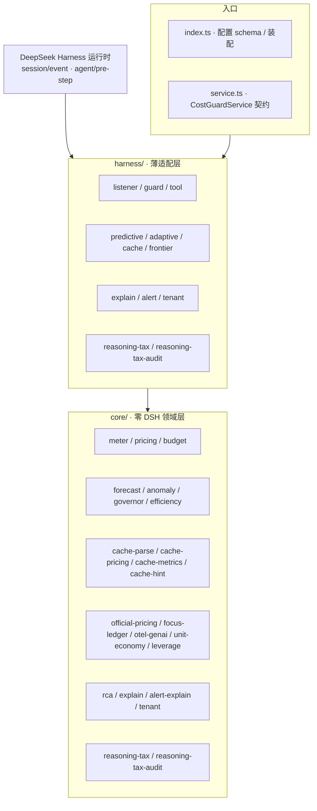

*图注：依赖方向单向——harness 依赖 core，core 不依赖任何 DSH 运行时；新增能力一律「core 纯领域 + harness 薄适配 + Config 开关」三步装配，未启用时零回归。*

目录结构：

```
src/
  core/        # 零 DSH 依赖的纯领域层
    types.ts     领域类型（用量/价格/预算/快照/时段）
    clock.ts     时区日/月分桶 + 今日结束/月末时刻 + 本月剩余天数（可注入时钟，可测）
    math.ts      统计与数值工具（clamp / 排序 / 百分位插值）
    pricing.ts   定价表 + 计价（用户配置优先、内置兜底；按本地时刻选带 + 带内价覆盖）
    meter.ts     四维计量器 + 日/月窗口表 + 分带累计桶
    trail.ts     成本轨迹采样（时刻→累计，有序/幂等/有界，喂预测引擎）
    forecast.ts  预测引擎（OLS 线性趋势 + 固定速率双模型自动降级、置信区间、Time-to-Exhaustion）
    anomaly.ts   异常检测（滑动窗口 MAD 尖峰分级 + 请求级成本预检估算）
    governor.ts  自适应预算调节器（月→日额度派生 + 消费速率背压动态水位 + 跨周期结转）
    efficiency.ts 成本效率洞察（每千输出 token 成本 + 请求分布 P50/P95/Max + 路由替代节约估算）
    cache-types.ts   缓存维度领域类型（TokenSplit / CacheLedgerRow / CacheSummary / PrefixCandidate）+ 端口（CacheUsageReader / CachePricingProvider / CacheLedgerStore）
    cache-parse.ts   缓存用量解析器（cached_tokens 校验 + 缺失/异常回退标注，ParseOutcome 判别）
    cache-pricing.ts 三通道 × 峰谷定价引擎（路由覆盖 > 全局 > 官方多厂商表 > 内置官方表；官方高峰判定 = 北京时间周一~周五非法定节假日 9-12/14-18 点；0.10.0 注入官方多厂商缓存表，缺省零回归）
    official-pricing.ts 多厂商官方计价引擎（官方模型注册表 OFFICIAL_MODEL_REGISTRY：6 厂商 47 条价目 + provider/currency/peakPolicy/sourceLevel/verifiedAt 元数据 + 缓存读/写价 + 模型名别名归一 + 官方峰谷时段选带与恒定价策略 + 推理 token 账本；buildOfficialPricingTable 以用户覆盖叠加官方价，覆盖 > 官方 > 内置 > 兜底；未启用零回归）
    cache-metrics.ts 缓存账本（Token 加权命中率 / 收益金额 / 不确定请求数，全局+会话+路由三级）
    cache-hint.ts    可优化前缀提示检测器（签名归并、minRepeat/minSaving 阈值、潜在节省估算）
    focus-ledger.ts  FOCUS 兼容成本台账（v1.2 Dimension/Metric 列规格：路由于账目/行类型/计费周期/分通道用量/金额/有效成本列；4096 行有界缓冲 + sink 逐行流出 JSONL）
    otel-genai.ts    OTel GenAI 语义遥测（GenAiSpan 标准属性 gen_ai.operation.name/request.model/response.model/system/usage.* + dsh.* 扩展；fnv1a32/stableHex 派生 trace/会话关联 ID；有界账本 + sink 流出）
    unit-economy.ts  单位经济学（会话/路由归属矩阵：每请求成本、每百万 token 成本、Top-N 会话份额，FinOps for GenAI Showback）
    leverage.ts      成本杠杆洞察（缓存折扣杠杆：读取价 vs 输入价差倍数/已省率/可再省率；输出杠杆：价差倍数/成本占比/压缩可省）
    rca.ts           成本根因分析器（0.14.0：会话/路由双视角增量贡献分解，主因/次因/噪声分级，topN 截断防长尾，通道构成）
    explain.ts       可解释成本叙事（0.14.0：中文总览/根因因子句/可执行建议——缓存命中杠杆、输出压缩杠杆、路由替代提示）
    alert-explain.ts 告警根因叙事（0.15.0：告警信号 + 根因报表 → 告警专属中文叙事，首句答「为什么告警」+ 会话/路由主因 + 建议收敛，单段/逐行双格式；零 DSH）
    tenant.ts       多租户成本解释视图（0.16.0：sessionId→租户解析器（mapping>prefix>regex，未命中兜底内置 'default'）+ 租户聚合（四通道全量）+ 租户间归因（复用 rca 增量贡献分解，主因/次因/噪声分级）+ 租户内主因会话两级证据链 + 中文叙事；纯函数/JSON 安全/零 DSH）
    reasoning-tax.ts 推理成本专项治理账本（0.17.0：按路由聚合推理 token / 可见输出 / 税成本（推理 token × 输出价）+ 全局与逐路由思考税 taxRatio + 主因路由识别 + 独立推理税预算水位 ok/warn/block + 中文叙事；纯函数/无副作用/零 DSH）
    reasoning-tax-audit.ts 多维思考税审计账本（0.18.0：会话维度 Top N 排行（默认 5）+ 时间热力桶（默认 60 分钟 × 24 桶）双切片聚合推理 token / 税成本，主因会话 + 热力峰值桶 + 中文审计叙事；与路由账本正交/零 DSH）
    budget.ts    预算决策引擎（纯函数；0.4.0 预测式策略 projection/spike/preflight；0.5.0 自适应 adaptive 策略）
    store.ts     快照持久化契约
  harness/     # 薄适配层（唯一接触 DSH API 的地方）
    listener.ts   session/event → UsageEntry（实时计量，按事件时刻选带）+ 轨迹/尖峰采样
    predictive.ts 预测上下文装配（buildForecastContext / preStepEstimate / sampleEntry）
    adaptive.ts   自适应调节装配（governorConfigFromAdaptive / buildGovernorInput）
    cache.ts      缓存计量适配（DshCacheUsageReader：响应 usage → 原始快照；attachCacheMeter：事件驱动 core 账本 + 回退告警；CachePanelPresenter：面板/洞察/提示输出）
    guard.ts      agent/pre-step → reject/cancel（熔断）+ 请求级预检 + 预测式触发达告警 + 自适应输入注入
    frontier.ts   前沿套件装配（FrontierRuntime：FOCUS/OTel 账本持有、unitEconomy/leverage 开关、record 入账路由、panel 面板、formatFrontierLines 人读行）
    explain.ts    成本根因解释适配（0.14.0：ExplainRuntime——current/delta 双模式 + 基线快照、panel 面板负载、cost_guard_explain 工具注册、formatExplainLines 人读根因行）
    alert.ts      告警根因解释适配（0.15.0：attachAlertExplain——Guard 决策投影告警信号 + ExplainRuntime 基线语义、onViolation 后追加告警根因叙事、onExplainAlarm 宿主回调 + 抛错降级、formatAlarmPanelLines/formatAlarmLines 告警行）
    tenant.ts      多租户成本解释适配（0.16.0：TenantRuntime——current/delta 双模式 + 基线快照、panel 面板负载、cost_guard_tenant 只读工具注册、formatTenantLines 人读多租户行）
    reasoning-tax.ts 推理成本专项治理适配（0.17.0：ReasoningTaxRuntime——思考税账本 + 独立预算水位、panel 面板负载、cost_guard_reasoning 只读工具注册、formatReasoningTaxLines 人读思考税行）
    reasoning-tax-audit.ts 多维思考税审计适配（0.18.0：ReasoningTaxAuditRuntime——会话 Top N + 时间热力双切片账本、panel 面板负载、cost_guard_reasoning_audit 只读工具注册、formatReasoningTaxAuditLines 人读审计行）
    tool.ts       cost_guard_status 工具 + 人读摘要（当前时段/生效单价/分带分布/预测尖峰/自适应/效率/缓存/前沿/租户/推理税/思考税审计）
  index.ts      插件装配（Config / apply）
  service.ts    CostGuardService 契约（inject 给其他插件）
tests/         单元测试（vitest，419 用例：369 存量 + 多租户成本解释视图 19 + 推理成本专项治理与多维思考税审计 31（reasoning-tax 8 + harness-reasoning-tax 8 + reasoning-tax-audit 9 + harness-reasoning-tax-audit 6））
scripts/smoke.mjs  冒烟测试（真实 lib 产物 + 真实 cordis Context，17 节）
```

数据流：


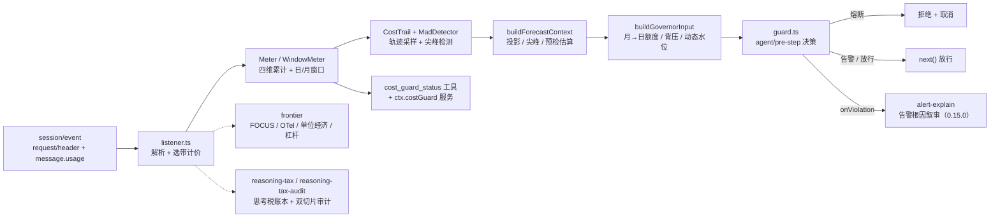

*图注：实线为主计量/熔断主链路；虚线为可选模块挂在 sampler 钩子上的旁路能力，未启用时 runtime 整体 undefined、输出与上一版本完全一致（零回归）。*


## 二次开发

```bash
npm install        # 安装依赖（Node ≥ 22.19）
npm run typecheck  # 类型检查
npm test           # 单元测试（vitest）
npm run build      # 产出 lib/（tsc + 类型声明）
npm run smoke      # 冒烟测试：加载 lib 产物跑真实链路
npm pack           # 发布包预检
```

- 新增价格口径：改 `core/pricing.ts` 的 `BUILTIN_PRICES`，规则为"用户配置优先、内置兜底"。
- 新增峰谷时段：在配置 `bands` 中加 `{ id, start, end, prices }`，`pricing.ts` 的 `bandIdForEpoch` 负责选带、`priceForAt` 负责带内覆盖与回退（core 内已含 `inBand`/跨午夜/全天解析与单测）。
- 新增缓存计费口径：改 `core/cache-pricing.ts` 的 `BUILTIN_CACHE_PRICES`（三通道价），规则为"路由覆盖 > 全局覆盖 > 内置兜底"；官方高峰判定在 `deepseekBandForEpoch`（可注入节假日表）。
- 新增预算维度：扩展 `core/types.ts` 的 `BudgetScope`，并在 `budget.ts` 的 `policiesFromConfig` 注册顺序。
- 新增预测策略：`core/budget.ts` 的 `PredictivePolicy` 是纯声明（projection/spike/preflight），决策逻辑为纯函数，直接加单测；harness 侧只需在 `harness/predictive.ts` 提供对应的事实构造器（如新的投影目标时刻解析器）。
- 新增事件消费：在 `harness/` 加适配器（如 `harness/cache.ts` 的 `attachCacheMeter`），领域逻辑放 `core/`，保持核心零 DSH 依赖。
- 扩展前沿套件：新台账/遥测/洞察能力先在 `core/` 实现纯领域模块（零 DSH），再在 `harness/frontier.ts` 的 `FrontierRuntime` 注册（`record` 入账路由 + `panel` 输出段 + `formatFrontierLines` 人读行），最后在 `index.ts` 的 `frontier` schema 加开关即可，未启用时零回归。
- 扩展推理税治理/审计：新增归因维度（如按任务/按周）先在 `core/reasoning-tax*.ts` 实现纯领域账本（零 DSH，追加同一 entry 互不读写），再在 `harness/reasoning-tax*.ts` 注册 runtime（`append` 入账 + `panel` 段 + 只读工具 + `format*Lines` 人读行），最后在 `index.ts` 的 `reasoningTax*` schema 加配置，未启用时零回归。
- 持久化：`core/store.ts` 定义 `CostSnapshot` 形状（含 `bands` 分带分布）；接入 `ctx.costGuard` 服务即可跨重启恢复。


## 与现有方案对比

| 方案 | 形态 | 实时性 | 阻断能力 | 进程内 | 事前治理 | 动态预算 |
| --- | --- | --- | --- | --- | --- | --- |
| whale-report | 事后报告插件 | 无（轮次结束后） | 无 | 是 | 无 | 无 |
| Token Monitor | 外部桌面工具 | 弱（外挂采集） | 无 | 否 | 无 | 无 |
| OTel / 按量计费网关 | 外部上报链路 | 中（链路延迟） | 无/网关级 | 否 | 无 | 无 |
| **dsh-cost-guard** | **原生插件** | **逐 token 调用计量** | **请求前熔断** | **是** | **预测外推 + 请求预检 + 尖峰检测** | **月→日额度派生 + 预测背压 + 跨周期结转** |


## 版本演进

| 版本 | 增量 |
| --- | --- |
| **0.18.0** | **多维思考税审计（Multi-Dimension Reasoning Tax Audit）：在 0.17.0 路由归因之上新增「会话维度 Top N 排行 + 时间热力桶」双切片审计——0.17.0 回答了「哪条路由在烧思考税」，0.18.0 回答「哪个会话在烧 / 一天中何时烧得最集中」。新增 core/reasoning-tax-audit.ts（零 DSH：会话维度按 sessionId 聚合推理 token/可见输出/税成本输出 Top N 排行（sessionTopN 默认 5）与主因会话 + 时间热力桶按 bucketMinutes 默认 60 分钟聚合、保留最近 heatBuckets 默认 24 个桶，输出热力序列与峰值桶 + 中文审计叙事（主因会话/热力峰值/会话思考预算收敛/热点错峰/时段预算护栏），与 0.17.0 路由账本正交互不读写），harness/reasoning-tax-audit.ts（ReasoningTaxAuditRuntime + 面板 reasoningTaxAudit 段 + 只读工具 cost_guard_reasoning_audit（市面无同类工具）+ formatReasoningTaxAuditLines 审计行）；默认关闭零回归（未启用与 0.17.0 完全一致）、core 零 DSH 保持；单测 404→419（+15：reasoning-tax-audit 9 + harness-reasoning-tax-audit 6）、tsc exit 0、build 成功、冒烟 17 节全过（新增 0.18.0 审计节，16→17）** |
| **0.17.0** | **推理成本专项治理（Reasoning Tax Governance）：把思维链「思考税」从展示项升级为可治理对象——市面 DSH 成本插件（dsh-billing / dsh-cost-meter / dsh-cost-tracker 等）只统计输入/输出/缓存三通道，无人按推理 token（思维链/thinking）专项计量与治理，而 2026 行业共识指出推理 token 按输出价计费、常为可见输出的 5~20 倍，是账单最大的隐藏成本。新增 core/reasoning-tax.ts（零 DSH：按路由聚合推理 token/可见输出/税成本（推理 token × 输出价）+ 全局与逐路由思考税 taxRatio + 主因路由识别 + 独立推理税预算水位 ok/warn/block（limit>0 才启用，纯新增维度不干预既有 budgets 熔断语义）+ 中文治理叙事（思考预算压缩/路由降级/切换非推理模型）），harness/reasoning-tax.ts（ReasoningTaxRuntime + 面板 reasoningTax 段 + 只读工具 cost_guard_reasoning + formatReasoningTaxLines 治理行）；默认关闭零回归（未启用与 0.16.0 完全一致）、core 零 DSH 保持；单测 388→404（+16：reasoning-tax 8 + harness-reasoning-tax 8）、tsc exit 0、build 成功、冒烟 16 节全过（新增 0.17.0 推理税专项节，15→16）** |
| **0.16.0** | **多租户成本解释视图（Multi-Tenant Cost Explanation View）：把成本归因从「会话/路由」推进到企业级「租户」维度——市面成本方案（LiteLLM/C1.ai/Azure/Snowflake）的归因止步于任务与模型视角，没有回答「钱是哪个团队/项目/工作区花的」，而 DSH 常被多租户共用同一实例；0.16.0 新增 core/tenant.ts（零 DSH：sessionId→租户解析器 mapping>prefix>regex + 未命中兜底内置 'default'、租户聚合四通道全量、租户间归因复用 rca 增量贡献分解主因/次因/噪声分级、租户内主因会话两级证据链、中文叙事），harness/tenant.ts（TenantRuntime current/delta 双模式 + 基线、面板 tenant 段、只读工具 cost_guard_tenant、formatTenantLines 多租户行）；默认关闭零回归（未启用与 0.15.0 完全一致）、core 零 DSH 保持；单测 369→388、tsc exit 0、ESLint 0、覆盖率门禁保持（全局 stmts 97.58%/branch 86.79%、store.ts 100%）、build 成功、冒烟 14→15 节全过** |
| **0.15.0** | **根因解释接入告警通知（Explainable Alarm）：把「知道为什么」推进到告警现场——市面成本告警只会喊「超了」，0.15.0 在 Guard 告警/熔断触发时同一条通知输出「为什么超」的中文告警根因叙事（core/alert-explain.ts 零 DSH：首句 scope/水位/Δ + 会话/路由双视角主因各 1 条 + 可执行建议，单段纯文本与逐行双格式可转发 IM/桌面通知）；harness/alert.ts 的 attachAlertExplain 挂载在 onViolation 之后，复用 ExplainRuntime 基线语义——首次触发存量归因并沉淀基线、后续与告警前基线增量归因（回答「这次为什么超」）；onExplainAlarm 宿主回调可收结构化负载（scope/action/window/report/lines），回调抛错自动降级不影响熔断主流程；explain.alert.enabled 默认关闭，未启用时告警行为与 0.14.0 完全一致（零回归）、core 零 DSH 保持；单测 349→369、tsc/ESLint 0、覆盖率门禁保持（全局 stmts 97.61%/branch 87.35%、store.ts 100%）、build 成功、冒烟 13→14 节全过** |
| 0.1.0 | 实时计量 + 四维预算 + 请求前熔断 + 成本工具 |
| 0.2.0 | 峰值时段计费（实时追踪） |
| 0.3.0 | 话费 + 积分双维度统计 |
| 0.4.0 | 预测式治理（投影 / 预检 / 尖峰），单测 56→104，冒烟 7→8 节 |
| **0.5.0** | **自适应调节（月→日额度派生 / 背压水位 / 跨周期结转）+ 成本效率洞察（每千输出成本 / 请求分布 / 替代节约建议），单测 104→128，冒烟 8→9 节** |
| **0.6.0** | **缓存维度计量（三通道×峰谷定价 / Token 加权命中率 / 缓存收益 / 可优化前缀提示 / 失败回退标注），单测 128→165，冒烟 9→11 节** |
| **0.7.0** | **深度升级：全量代码质量与健壮性治理——类型安全收敛（消除 any/断言）、边界与空值防护（NaN/Infinity/负值/缺省归一化）、错误路径 fail-safe 隔离（宿主回调异常不反噬结算与熔断链路）、schema 缺省兼容修复（0.5.0 存量配置可载入）、受控 JSON 投影（无损、拒绝 -0/循环引用）、复杂度清理（魔法数字语义化、重复计算抽取），单测 165→182** |
| **0.9.0** | **全模型官方计价深度同步：官方模型注册表（OFFICIAL_MODEL_REGISTRY）登记 DeepSeek 全部模型三状态（在售 / 下线路由 / 已停用），价目与别名由单一事实源派生、覆盖范围从 2 个在售模型扩展为官方全部模型；已停用模型（chat/reasoner/coder）如实登记停用日期与迁移建议，取价回落内置/兜底零回归；摘要与 cost_guard_status 输出官方模型状态全景（在售 N 个 · 下线路由 M 个 · 已停用迁移提示），单测 214→223** |
| **0.8.0** | **官方计价引擎：对 DeepSeek 实际计价规则体现最准确——主计量+缓存计量统一挂载官方价目（2026-09-10 生效，flash/v4-pro 空闲价 + 高峰×2）与官方峰谷自动判定（北京时间周一~周五非法定节假日 9-12/14-18 点，2026 中国法定节假日表内置）、downlevel 模型名别名归一（旧名不再落兜底最贵档）、推理 token 独立计量与成本洞察（按官方输出价）、官方节假日表可扩展、官方价可覆盖、官方无 Batch 折扣不虚构，单测 182→214，冒烟 11→12 节** |
| **0.10.0** | **多厂商官方计价深度同步：官方模型注册表扩展 provider/currency/peakPolicy/sourceLevel/verifiedAt 五维元数据，登记 OpenAI GPT(8)、Anthropic Claude(13 含缓存读+写价)、Google Gemini(10)、Mistral(6)、Meta Llama(3)、DeepSeek(7) 共 47 条官方价目（核对日 2026-10-05）；币种 DeepSeek=CNY 其余=USD 不换算；DeepSeek 官方高峰 ×2、其余厂商恒定价；缓存写价独立承载；官方全景按厂商分组、official.prices 全量路由输出，单测 →235，冒烟保持 12 节** |
| **0.11.0** | **国内主流模型官方计价深度同步：注册表总量 47→102 条，新增智谱GLM(9)、阿里通义Qwen(6)、字节豆包(4)、月之暗面Kimi(4)、百度文心(6)、百川(12)、MiniMax(3)、阶跃星辰(5)、讯飞星火(6) 共 9 家国内厂商 55 条官方价目（核对日 2026-10-05，全部 official 定价页直抓，币种 CNY）；百川/百度元/千 tokens ×1000 折算每百万；新增 baichuan-tier 峰谷策略（Baichuan2-53B 每日 0-8 点低谷 / 8-24 点高峰 ×2），officialBandForEpochOf 按模型选带；Kimi/MiniMax/Qwen 缓存写价持续承载；阶梯价主档+note；星火免费模型 0 价不触发兜底；summary 按厂商+币种分组输出，单测 235→246，冒烟保持 12 节** |
| **0.12.0** | **前沿套件（Frontier Suite）：对齐世界前沿标准把成本治理升级为可观测 + 可对账成本套件——FOCUS 成本台账（FinOps Foundation v1.2 Dimension/Metric 列规格，标准行 + 4096 行缓冲 + sink 逐行 JSONL 流出，可流入任意 FinOps 工具）、OTel GenAI 遥测（OpenTelemetry GenAI Semantic Conventions 标准 span 属性 + FNV-1a/稳定十六进制 trace·会话关联 ID + sink 流出，可进 Prometheus/Jaeger/Grafana 等可观测性栈）、单位经济学与成本归属（每请求/每百万 token 成本、Top-N 会话份额，FinOps for GenAI Showback 到业务单元）、成本杠杆洞察（缓存折扣杠杆：读取价 vs 输入价差倍数/已省率/可再省率；输出杠杆：价差倍数/占比/压缩 10% 可省）；全部默认关闭、core 零 DSH，未启用时与 0.11.0 行为完全一致（零回归），单测 246→287，冒烟保持 12 节** |
| **0.14.0** | **成本根因解释（Explainable Cost RCA）：从「知道超了」到「知道为什么」——市面成本方案止步于统计与归因（Snowflake 官方博客：knowing that an anomaly occurred is only half the battle），0.14.0 新增证据化成本根因分析（core/rca.ts：会话/路由双视角增量贡献分解，主因/次因/噪声分级，Δ 与基线对比归因，topN 截断防长尾刷屏）、可解释成本叙事（core/explain.ts：中文总览/根因因子句/可执行建议，缓存杠杆/输出压缩/路由替代建议）；注册只读工具 cost_guard_explain（Agent 自助「为什么成本涨了」+ 双模式 current/delta 增量归因）；默认关闭零回归（未启用与 0.13.0 完全一致）、core 零 DSH 保持；单测 319→349、覆盖率门禁保持（全局 stmts 97.25%/branch 86.94%、store.ts 100%）、tsc exit 0、ESLint 0、build 成功、冒烟 12→13 节全过** |
| **0.13.0** | **全量代码质量进化（Quality Evolution）：TS 5 项严格选项全开（exactOptionalPropertyTypes / noPropertyAccessFromIndexSignature / noFallthroughCasesInSwitch / noImplicitOverride / noUncheckedSideEffectImports）并清零类型错误；接入 typescript-eslint strictTypeChecked 静态检查（88 项违规归零，含 2 项有据取舍：跨边界防御式空值回退保留为准、数字模板插值放行 allowNumber）；新增 lint/coverage/quality 工程脚本与覆盖率门禁（全局 stmts≥90%/branch≥85%、store.ts 100%）；补测 45 个新用例（快照持久化/入口集成/数值统计/杠杆边界）；319 单测全绿、tsc exit 0、build 成功、冒烟 12 节全过，core 零 DSH 与零回归不变量保持** |


<details>
<summary>各版本深度要点（0.5–0.12，点击展开）</summary>


**0.12.0 前沿套件要点（全部保持未启用新配置时与 0.11.0 行为完全一致，零回归）：**

1. **对齐世界前沿标准的四路落点**：调研核证 FinOps 基金会 **FOCUS v1.2**（统一成本列规格 Dimension/Metric 与 Mandatory/Conditional/Optional/Recommended 功能级别，Azure 已对齐输出）、CNCF 毕业项目 **OpenTelemetry GenAI Semantic Conventions**（LLM 调用 span 标准属性 `gen_ai.operation.name`/`request.model`/`response.model`/`system`/`usage.input_tokens`/`usage.output_tokens`）、**FinOps for GenAI 单位经济学/Showback**（成本归属到业务单元）、**2026 缓存/输出杠杆共识**（缓存读取价≈输入价 0.1 倍可省 90%、输出 token 单价≈输入 4 倍压输出 ROI 最高）——四个世界级前沿全部落地为可验证能力，插件从「内部成本报表」升级为「可观测 + 可对账成本套件」。
2. **FOCUS 成本台账（`core/focus-ledger.ts`）**：`FocusUsageLine` 按 FOCUS v1.2 侧规输出标准列——路由于账目/行类型/计费周期/输入·缓存命中·输出分通道用量/金额/有效成本列，全量汇聚为有界账本（4096 行缓冲）+ `sink` 回调逐行流出（可写 JSONL 文件或转发任意 FinOps 工具）；`FocusLedger` 入账解决"成本数据能否直接与企业 FinOps 平台对账"的世界级刚需。
3. **OTel GenAI 遥测（`core/otel-genai.ts`）**：`GenAiSpan` 按 OTel GenAI Semantic Conventions 输出标准属性 + `dsh.*` 扩展（route/band/cacheReadTokens/currency/cost），用 **FNV-1a 32 位哈希 + 稳定十六进制**（`fnv1a32`/`stableHex`）从会话派生 **trace/span 关联 ID**，`OtelLedger` 有界账本 + `sink` 流出——成本轨迹可直接进 Prometheus/Jaeger/Grafana 等既有可观测性栈，不再封闭在插件内部。
4. **单位经济学与成本归属（`core/unit-economy.ts`）**：`buildUnitEconomics` 输出会话/路由归属矩阵——**每请求成本、每百万 token 成本、Top-N 会话成本占比与份额**（Showback 到业务单元），回答"钱花在哪个会话、单次任务单价多少、TOP 会话吃掉多少预算"。
5. **成本杠杆洞察（`core/leverage.ts`）**：**缓存折扣杠杆** `cacheDiscountLeverOf`——缓存读取价 vs 标准输入价差倍数（DeepSeek flash 0.02 vs 1.00 = 50 倍）、相对全未命中基线的**已省率**与**可再省率**（量化"提高命中还能再省 Y 元"）；**输出杠杆** `outputLeverOf`——输出单价 vs 输入价差倍数与输出成本占比，给出"输出压缩 10% 可省 Y 元"（输出是质量与成本的双重杠杆）。只提示、不干预请求。
6. **装配与零回归**：`src/harness/frontier.ts` 的 `FrontierRuntime` 挂在主计量 `sampler` 钩子（`index.ts` 既有 `(entry, sessionId) => {}`）上，`record` 一次入账路由到台账/遥测/单位经济/杠杆四路；`cost_guard_status` 新增 `frontier` 段、摘要新增前沿行（FOCUS 行数 / OTel span 数 / 单位经济学 / 缓存·输出杠杆）。配置 `frontier` 全部**默认关闭**，未启用时 runtime 整体 undefined、输出与 0.11.0 完全一致；四个新模块全部在 `core/` 零 DSH 依赖，六边形架构不变。单测 246 → **287** 全绿（新增 focus 7 / otel 9 / unit 4 / leverage 8 / frontier 9 / schema 4）、tsc/build/冒烟全过。

**0.11.0 国内厂商深度同步要点（全部保持未启用新配置时与 0.10.0 行为完全一致，零回归）：**

1. **9 家国内厂商 55 条官方价目单一事实源**：`OFFICIAL_MODEL_REGISTRY` 总量 47 → 102 条，新增全系国内主流模型（智谱 GLM-5.3/5.3-Flash/5.3-FlashX/5.2/5.1/5-Turbo/5/4.7/4.5-Air、通义 Qwen3.8-Max/3.8-Flash/3.5-Plus/3-Max/3.8-Omni-Flash/Qwen-Long、豆包 Seed2.1-Pro/Evolving/2.1-Turbo/Character、Kimi K3/K2.7-Code/K2.7-Code-Highspeed/K2.6、文心 ERNIE-5.0/5.0-Thinking-Preview/X1.1-Preview/4.5 系、百川 M3-Plus/M3/M2-Plus/M2/4-Turbo/4/4-Air/3-Turbo/2-Turbo/2-53B/Text-Embedding、MiniMax M3/M2.7/M2.7-Highspeed、阶跃 Step-5-Preview/3.7-Flash/3.5-Flash/1o-Turbo-Vision、星火 X2.5/X2.5-4B/X2.5-1.7B/X2/X2-Flash/Lite），价目、币种、峰谷策略、来源分级、核对日期全部由注册表派生，全部官方定价页直抓（sourceLevel=official，verifiedAt=2026-10-05）。
2. **币种与计价单位对齐**：国内 9 家厂商统一 CNY（元）；百川（官方「元/千 tokens」）与百度文心（官方「元/千 tokens」）按 ×1000 折算为「元/百万 tokens」对齐全局口径，从源头消除单位错配；DeepSeek 保持 CNY、世界厂商保持 USD，不跨币种换算、不虚构汇率。
3. **新增 baichuan-tier 峰谷策略**：百川 Baichuan2-53B 为国内唯一官方峰谷定价——每日 0:00-8:00 低谷 0.01 元/千（10/百万）、8:00-24:00 高峰 0.02 元/千（20/百万，×2）。实现 `baichuanBandForEpoch(timeMs, tzOffsetMin)`（东八区每日时段判定）与 `officialBandForEpochOf(model, timeMs, tzOffsetMin, holidays?)`（按模型策略选带：baichuan-tier 走百川时段、flat 回落 DeepSeek 峰谷判定但不影响价格——free 恒 0、flat 恒空闲价），harness listener 统一接线，flat 模型价格不随峰谷变化（零回归）。
4. **缓存写价持续承载**：ModelPrice 可选 `cacheWritePerMillion` 扩展至国内厂商——Kimi K3 缓存写 5min 档 20（1h 档 40 note）、MiniMax M2.7 系缓存写 2.625、通义 Qwen 显式缓存创建价承载（Qwen3.8-Flash 1.25、Qwen3.5-Plus 1）；未定义该字段的模型行为与 0.10.0 完全一致（零回归）。
5. **阶梯价主档+note 登记**：智谱 GLM-5.1/5-Turbo/5/4.7、通义 Qwen3.5-Plus/3-Max、百度 ERNIE-5.0 系官方按上下文长度阶梯计费——主档登记低档价、note 登记高档价与分档区间，账单侧按官方分档规则取档，展示明示阶梯区间，不虚构高档主档。
6. **免费模型不触发兜底**：讯飞星火 X2.5-4B / X2.5-1.7B / Lite 官方免费（0 元）——登记 0 价且取价标注 official（非 fallback），免费模型成本恒 0、不落入保守兜底档；传统 Spark 4.0 Ultra/Max/Pro 无现行官方价目，不登记（避免虚构）。
7. **官方事实对齐与零回归**：百川 M3-Plus 自动触发「医疗搜索」0.03 元/次、豆包缓存存储 0.017 元/小时均按官方口径登记 note（不入 token 单价）；缓存价官方未公开处保守按输入价 + note，不虚构。所有新字段仅在 `officialPricing.enabled` 且对应厂商数据存在时启用；未启用新配置时与 0.10.0 完全一致（core 零 DSH），单测 235 → 246 全绿、tsc/build/冒烟全过。

**0.10.0 多厂商深度同步要点（全部保持未启用新配置时与 0.9.0 行为完全一致，零回归）：**

1. **全球主流模型官方价目单一事实源**：`OFFICIAL_MODEL_REGISTRY`（`src/core/official-pricing.ts`）登记 6 大厂商 47 条官方价目与语义——OpenAI GPT（8 条，GPT-5.6/5.5-Pro/5.5/5.4 系）、Anthropic Claude（13 条，在售 4 + Legacy 9，含缓存读价与写价 `cacheWritePerMillion`）、Google Gemini（10 条，Gemini 3 系 + 2.5 系）、Mistral（6 条）、Meta Llama（3 条开源托管，无官方 API 价登记 `oss` 状态不定价）、DeepSeek（7 条，在售 2 / 下线路由 2 / 已停用 3）。价目、别名、元数据全部由注册表派生，数值与 0.9.0 完全一致，覆盖范围从 DeepSeek 全模型扩展为世界主流模型。
2. **五维元数据，不虚构口径**：每模型登记 `provider / currency / peakPolicy / sourceLevel / verifiedAt`——币种 DeepSeek=CNY、其余=USD（**不跨币种换算，不虚构汇率**，展示按模型标注币种）；峰谷策略 DeepSeek 官方高峰 ×2（`dsn-peak`）、其余厂商**恒定价**（`flat`，official peek=idle，band 不影响价格）；来源分级 `official`（官方价目直抓）/ `aggregated`（多源交叉）如实标注；核对日 `verifiedAt=2026-10-05`。官方未公布值（如部分缓存写价）保守取输入价 + `note` 注明，不虚构。
3. **缓存写价独立承载**：Anthropic 官方按「缓存命中读 / 缓存写入 / 未命中输入 / 输出」四通道计费；`ModelPrice` 新增可选 `cacheWritePerMillion`，`computeCost` 在定义时按 `cacheWriteTokens` 加算缓存写成本；其余厂商未定义该字段时行为与 0.9.0 完全一致（零回归）。
4. **官方全景按厂商分组展示**：摘要官方行按厂商分组（如 `官方模型(OpenAI): 在售 8 个（USD 恒定价）`）；`cost_guard_status` 返回结构新增 `official.prices` 全量价目路由（provider 按模型厂商标签）+ `official.registry` 五维元数据，用户终端即可看到全球主流模型官方价目全貌与定价策略。
5. **官方事实对齐与零回归**：OpenAI 全域名反爬时改用 Azure 官方同源页 + 官方权威媒体交叉（GPT-5.5 缓存价等未获官方确认处保守处理并不虚构）；Gemini 官方模型页直抓；Mistral 官方站不可达用双源交叉（sourceLevel=aggregated）；Meta Llama 开源权重无官方托管 API 价目 → 登记 `oss` 状态不定价。所有新字段仅在 `officialPricing.enabled` 且对应厂商数据存在时启用，未启用新配置时与 0.9.0 完全一致（core 零 DSH）。

**0.9.0 全模型深度同步要点（全部保持未启用新配置时与 0.8.0 行为完全一致，零回归）：**

1. **官方模型注册表成为单一事实源**：新增 `OFFICIAL_MODEL_REGISTRY`（`src/core/official-pricing.ts`），登记 DeepSeek 官方全部模型名与官方语义——在售 `deepseek-flash` / `deepseek-v4-pro`（官方价目）、下线路由 `deepseek-v4-flash` / `deepseek-v4-flash-vision-exp`（归一 flash 价）、已停用 `deepseek-chat` / `deepseek-reasoner` / `deepseek-coder`（无官方价，登记停用日期与迁移建议）。价目表与别名映射由注册表派生，数值与 0.8.0 完全一致，覆盖范围从 2 个在售模型扩展为官方全部模型。
2. **三状态计价语义，零回归**：active 查官方价目（高峰 = 空闲 ×2）；routed 归一目标模型后按目标价计费；decommissioned 无官方价，取价回落内置价表（chat 2/0.5/8、reasoner 4/1/16）/ 兜底（coder 4/1/16），与 0.8.0 行为完全一致，不虚构已停用模型价格。
3. **官方状态全景展示**：`cost_guard_status` 返回结构新增 `official.registry` 段，摘要输出「官方模型: 在售 N 个 · 下线路由 M 个」与「官方停用: 已停用（请求不再可用，迁移至 …）」两行，用户终端即可看到官方模型全貌与迁移目标。
4. **官方事实对齐**：以更新日志 2026-09-10 更正声明为准（9-14 之后继续提供 V4 Pro API、计费不变），排除同日新闻稿冲突表述；官方无 Batch 折扣不虚构；峰谷/节假日/推理 token 计量沿用 0.8.0 官方口径。

**0.8.0 官方计价引擎要点（全部保持未启用 new 配置时与 0.7.0 行为完全一致，零回归）：**

1. **对官方实际计价规则体现最准确**：内置 DeepSeek 官方价目表（2026-09-10 生效：`deepseek-flash` 空闲 命中 0.02 / 未命中 1.00 / 输出 4.00 元/M，`deepseek-v4-pro` 空闲 0.15 / 4.50 / 13.50 元/M，高峰 = 空闲 ×2），主计量与缓存计量统一挂载。此前主计量内置价表未收录新模型，flash 落兜底最贵档（空闲未命中 4→1 元、命中 1→0.02 元、输出 16→4 元）；启用后成本与官方账单逐通道对齐。
2. **官方峰谷自动挂载主计量**：主计量此前未配置 `bands` 时全天按基准价计费；0.8.0 按官方口径自动判定——北京时间周一至周五（**不含中国法定节假日**）9:00-12:00 与 14:00-18:00 为高峰（×2），周六周日与法定节假日全天低谷，2026 全年节假日表内置并对齐国务院公告。
3. **模型名别名归一，不再高估**：官方已下线但仍可调用的 `deepseek-v4-flash` / `deepseek-v4-flash-vision-exp` 自动归一到 flash 官方价，避免因模型名未收录而落兜底最贵档（此前命中价高估 50 倍、输出价高估 4 倍）。
4. **推理 token 独立计量**：从 `usage.reasoning_tokens` 采集思维链 token，按官方输出价（官方无单独推理价格）累加推理成本并输出累计 token 与金额，回答"思维链花了多少钱"。
5. **官方价可覆盖、节假日表可扩展、不虚构规则**：用户 `pricing` / `bands` / `cache.priceOverride` 覆盖始终优先于官方价（覆盖价不参与高峰翻倍）；`officialPricing.holidays` 可向节假日表追加/覆盖日期（补班日按工作日高峰恢复）；官方无 Batch API 批量折扣，第三方渠道行为一律不纳入产品口径。

**0.7.0 深度升级要点（全部保持未启用新配置时与 0.6.0 行为完全一致，零回归）：**

1. **类型安全收敛**：全量消除 `any` / 隐式 any / 非必要非空断言。计数、异常、预算、存储、定价、计量、治理、装配各层均以谓词守卫（`isBudgetScope`/`isCostSnapshot`/`isJsonValueSafe` 等）收紧输入类型，`strict` + `noUncheckedIndexedAccess` 下 `tsc --noEmit` 零错误。
2. **边界与极端值防护**：所有外部输入（宿主事件、配置、价格表、解析产物）统一做 null/undefined 与数值边界归一化——NaN/Infinity/负值/超限输入不再扩散为脏数据，取整与跨午夜/时区计算显式防御。
3. **错误路径 fail-safe 隔离**：计量、缓存、熔断三处事件回调及全部宿主回调（估算 / forecast / adaptive / 通知）异常时记录可识别错误并降级跳过，**绝不反噬宿主推理与结算链路**；估算不可得、评估失败时按既定语义放行并留痕。
4. **schema 缺省兼容修复**：修复 0.6.0 引入的缓存配置 schema 缺省缺陷——未配置 `cache` 的存量 0.5.0 配置加载不再误报 `missing required value`（`optionalObject` 语义：对象整体可选、一旦提供内部 required 字段必须给全），并纳入回归测试。
5. **受控 JSON 投影**：`cost_guard_status` 输出改为无损 JSON 投影（`toToolJson`），过滤未启用模块的 undefined 键，拒绝 NaN/Infinity/-0/循环引用并抛可识别错误——修复 0.6.0 的 `-0` 判断缺陷（`0 === -0` 会把合法数值 0 误判为非法值）。
6. **复杂度与可维护性**：魔法数字语义化为命名常量（高峰时段 / 预测置信权重 / 动态水位缩放 / 单位换算），抽取重复计算（带价格表预构建、动作升级统一 `escalate`），六边形依赖方向核对通过（core 零 DSH 依赖）。

0.6.0 的行业增量点（全部遵循六边形架构，core 层零 DSH 依赖，默认关闭、未配置时与 0.5.0 完全一致）：

1. **把成本算对，而不是算保守**：此前所有输入按未命中价计费，系统性高估成本（flash 价差 50 倍、v4-pro 30 倍）。0.6.0 按官方三通道口径核算，成本与账单对齐，同时首次量化出"缓存到底帮你省了多少钱"——这是成本治理类插件中首个**缓存维度计量**产品级实现。
2. **命中率按 Token 加权，而不是简单平均**：会话/路由/全局三级汇总均以命中 Token ÷ 输入 Token 计算，数据量大的请求权重更高，指标不被小请求稀释。
3. **可执行的前缀优化提示，而非"请优化"**：识别高频重复且未命中占比高的前缀，直接给出"若稳定化可节省约 Y 元"，把 50 倍价差变成可执行的省钱动作（只提示、不代改，避免破坏性自动化）。
4. **失败可归因、不脏数据**：缓存字段缺失/异常时按保守口径计费并标注不确定度，命中率统计天然隔离不可信样本，连续 5 次回退还给出升级/排查提示——保证指标可信、可审计。

0.5.0 的行业增量点（全部在 core 层零 DSH 依赖实现，默认关闭、未配置时与 0.4.0 语义完全一致）：

1. **费用自适应而不是配额僵化**：市面预算插件把 `day.limit` 当静态配额，月初猛花月底干瞪眼，或全程限死浪费冗余。0.5.0 把「今天还能花多少」变为动态派生：月剩余可用 ÷ 剩余天数，配合预测引擎的背压——花得快就紧、花得稳就松，预算自动跟随消费节奏。
2. **预测驱动的水位不是拍脑袋阈值**：静态 `warnAt/hardAt` 对所有人一刀切；0.5.0 的告警/阻断水位由当月消费速率与剩余天数实时计算，越接近月末、预测越险，水位自动下探，等于「预算越紧张，防线越靠前」。
3. **省下来的能结转，而不是归零清零**：本月末未用完 × `carryOverRatio` 结转为次月 `carriedIn` 可用池，持续"奖励"节约行为，解决"月底不敢用、月初没得用"的周期性浪费。
4. **从"花了多少"到"花得值不值"**：每千输出 token 成本把质量与成本挂钩（输出是推理质量的载体），请求成本分布暴露长尾拖累，路由替代估算直接给出行得通的省钱动作，而非一句"请控制用量"。


</details>

## License

MIT
